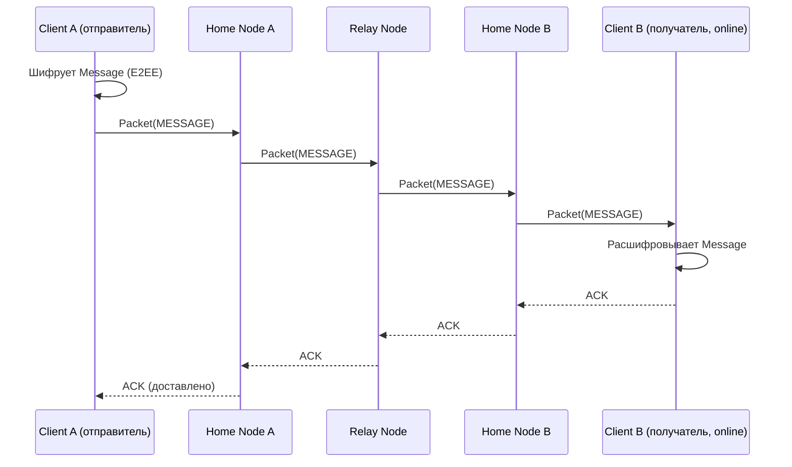
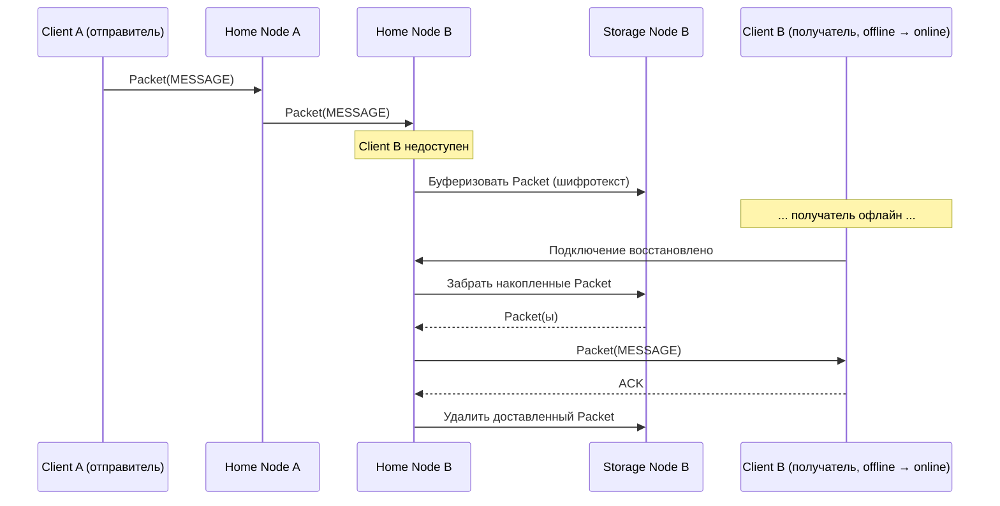

# 0102. Потоки данных

## Статус
Черновик

## Назначение
Описание того, как данные перемещаются между компонентами системы для
основных сценариев. Термины — см. [0004_GLOSSARY.md](0004_GLOSSARY.md).

## Основные сценарии

### Отправка сообщения (получатель онлайн)
1. Client отправителя формирует Message, шифрует его на уровне Crypto Layer (см. [0300_CRYPTO.md](0300_CRYPTO.md)) и упаковывает в Packet.
2. Client отправителя запрашивает у Discovery Node адрес Home Node получателя (результат кэшируется, см. [0604_DISCOVERY_NODE.md](0604_DISCOVERY_NODE.md)).
3. Packet отправляется на Home Node отправителя, которая пересылает его через один или несколько Relay Node к Home Node получателя (см. [0203_ROUTING.md](0203_ROUTING.md)).
4. Home Node получателя доставляет Packet активному Client получателя.
5. Client получателя расшифровывает Message и отправляет подтверждение доставки (ACK) в обратном направлении (см. [0202_DELIVERY.md](0202_DELIVERY.md)).

### Отправка сообщения (получатель офлайн)
1. Шаги 1–3 идентичны сценарию выше.
2. Home Node получателя недостижима напрямую или не имеет активного соединения с Client получателя — Packet передаётся на связанный Storage Node.
3. Storage Node хранит зашифрованный Packet до подключения получателя или истечения retention-периода (см. [0602_STORAGE_NODE.md](0602_STORAGE_NODE.md)).
4. При следующем подключении Client получателя Home Node забирает накопленные Packet со Storage Node и доставляет их получателю.
5. После подтверждённой доставки Packet удаляется со Storage Node.

### Доставка медиа
1. Client отправителя шифрует файл локально (ключ файла передаётся только внутри зашифрованного Message, Media Node его не получает).
2. Зашифрованный файл загружается на Media Node, привязанную к Home Node отправителя или указанную получателем.
3. В Message получателю передаётся ссылка на объект и ключ расшифровки (внутри E2EE-конверта).
4. Client получателя скачивает зашифрованный объект напрямую с Media Node и расшифровывает локально.

Подробности хранения — см. [0603_MEDIA_NODE.md](0603_MEDIA_NODE.md),
[0701_S3.md](0701_S3.md).

### Обнаружение пира (discovery)
1. Client запрашивает у известного Discovery Node адрес Home Node по UserID.
2. Discovery Node возвращает подписанную запись (адрес Home Node + отметка времени/версии) либо перенаправляет запрос на другой Discovery Node, если запись реплицирована не локально.
3. Client проверяет подпись записи собственными средствами Crypto Layer, не доверяя Discovery Node напрямую (Zero Trust).
4. Результат кэшируется на клиенте с ограниченным TTL.

### Синхронизация состояния между устройствами
1. Каждое Device пользователя имеет собственную Identity и независимо подключается к Home Node.
2. Home Node доставляет каждый Packet на все активные Device пользователя (fan-out), либо, если устройство офлайн — через связанный Storage Node.
3. Порядок и состояние прочтения синхронизируются как отдельные Event (см. [0004_GLOSSARY.md](0004_GLOSSARY.md) → Event), а не как мутация уже доставленного Message — это позволяет каждому устройству независимо восстановить состояние после разрыва соединения (Offline First).

## Обработка офлайн-получателя
Storage Node — единственный компонент, которому разрешено удерживать
сообщение дольше времени одной сетевой транзакции. Он не имеет доступа к
содержимому (хранит только шифротекст) и не участвует в принятии решений о
маршрутизации — это исключительно буфер между Relay/Home Node и моментом,
когда получатель снова окажется на связи.
