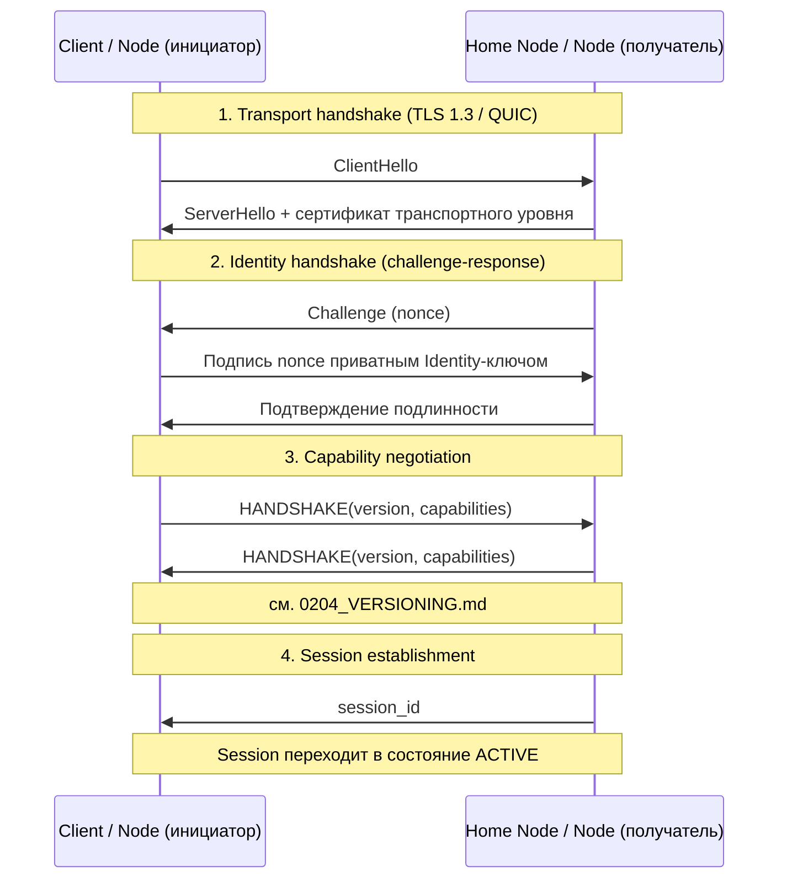

# 0200. Протокол

## Статус
Черновик

## Назначение
Описание прикладного протокола обмена сообщениями: версии, состояния,
рукопожатие. Это спецификация в терминах Protocol
([[0004_GLOSSARY]]) — она не зависит от языка реализации (Protocol Before
Implementation, [[0003_ENGINEERING_PRINCIPLES]]).

## Версионирование протокола
Протокол версионируется по схеме `MAJOR.MINOR`:
- `MAJOR` увеличивается при несовместимых изменениях формата или семантики Packet.
- `MINOR` увеличивается при обратно совместимых дополнениях (новые необязательные поля, новые типы Packet, новые Capability).

Версия протокола передаётся в каждом Packet заголовке (см.
[0201_PACKETS.md](0201_PACKETS.md)) и согласуется на этапе handshake.
Реализация обязана отклонять `MAJOR`-версии, которые она не поддерживает, и
может игнорировать неизвестные необязательные поля более новых
`MINOR`-версий (Backward Compatibility).

## Установление соединения / handshake
1. **Transport handshake** — установление зашифрованного канала на уровне транспорта (см. [0103_NETWORK.md](0103_NETWORK.md); TLS 1.3 или эквивалент QUIC-рукопожатия). Этот уровень защищает канал между двумя соседними узлами, но не заменяет E2EE между отправителем и получателем.
2. **Identity handshake** — стороны обмениваются и проверяют Identity (см. [0300_CRYPTO.md](0300_CRYPTO.md)) через challenge-response на приватных ключах. Пароли не используются.
3. **Capability negotiation** — стороны обмениваются поддерживаемой версией протокола и списком Capability (какие типы Packet и расширения поддерживаются).
4. **Session establishment** — создаётся Session (см. [0004_GLOSSARY.md](0004_GLOSSARY.md)) с одноразовыми идентификаторами для последующего обмена Packet.

## Состояния сессии
`INITIATING → HANDSHAKING → ACTIVE → IDLE → CLOSED`

- `ACTIVE` — Session используется для обмена Packet.
- `IDLE` — соединение не используется, но состояние Session сохранено локально и может быть восстановлено без повторного handshake (см. Offline First).
- `CLOSED` — Session завершена; повторное взаимодействие требует нового handshake. Session не является Identity — её потеря не означает потерю криптографической идентичности.

## Совместимость и обратная совместимость
- Новые поля Packet добавляются только как необязательные.
- Новые типы Packet не должны требовать изменения обработки уже существующих типов.
- Любое несовместимое изменение проходит через ADR и объявляется в новой `MAJOR`-версии с периодом параллельной поддержки.
- Полная процедура согласования версий и устаревания — см. [0204_VERSIONING.md](0204_VERSIONING.md).

## Связанные документы
- [0201_PACKETS.md](0201_PACKETS.md)
- [0202_DELIVERY.md](0202_DELIVERY.md)
- [0203_ROUTING.md](0203_ROUTING.md)
- [0204_VERSIONING.md](0204_VERSIONING.md)
- [0300_CRYPTO.md](0300_CRYPTO.md)
