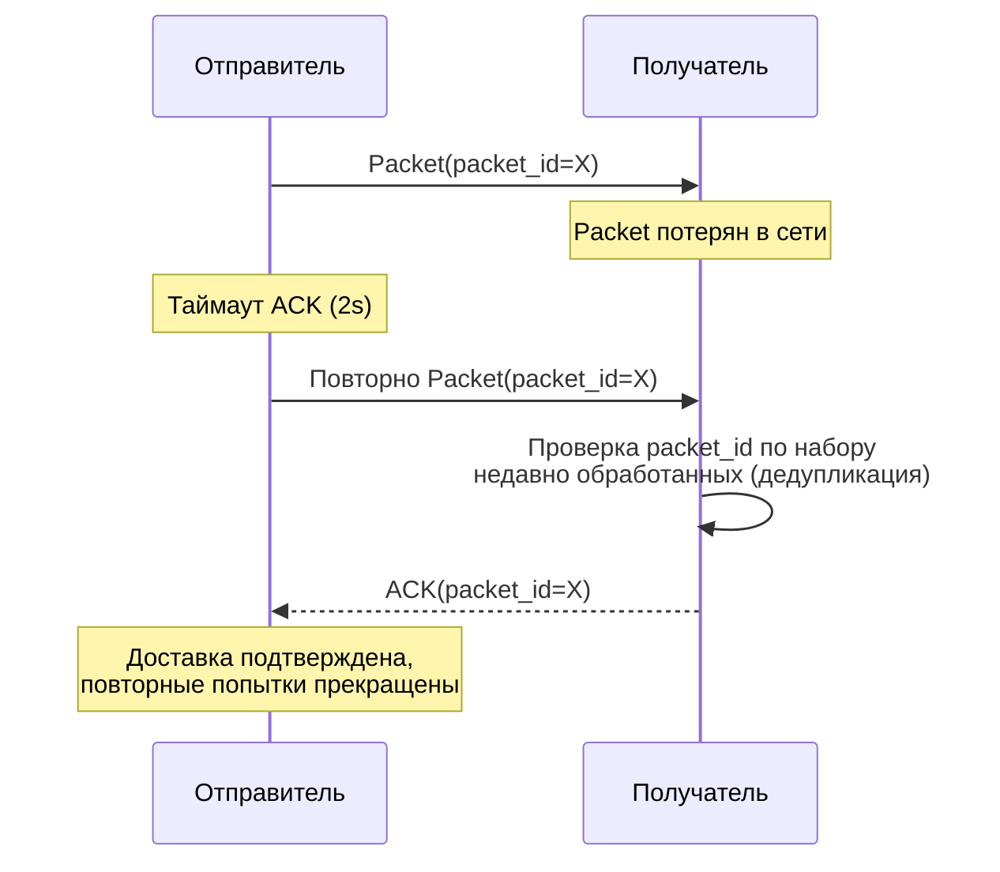

# 0202. Доставка

## Статус
Черновик

## Назначение
Гарантии доставки сообщений: подтверждения, повторные попытки,
дедупликация, порядок.

## Гарантии доставки
Протокол гарантирует **at-least-once** доставку на транспортном уровне;
**exactly-once**-семантика для пользователя достигается сверху за счёт
дедупликации по `packet_id` на принимающей стороне (Client, Home Node,
Storage Node). Полная потеря Packet после подтверждённого ACK не
допускается ни при каких условиях сети.

## Подтверждения (ACK)
Каждый Packet типа `MESSAGE` требует ACK от следующего узла на маршруте
(hop-by-hop) и итогового ACK от Client получателя (end-to-end). Hop-by-hop
ACK подтверждает только факт передачи между двумя узлами; end-to-end ACK —
единственное подтверждение, которое видит Client отправителя как «доставлено».

## Повторная отправка и таймауты
Если ACK не получен в течение таймаута (адаптивного, на основе измеренного
RTT — референс: экспоненциальный backoff начиная с 2 секунд), отправитель
повторяет передачу того же Packet с тем же `packet_id`. Количество попыток
ограничено на транспортном уровне; после исчерпания попыток Packet
переносится в Storage Node получателя как офлайн-доставка (см.
[0102_DATA_FLOW.md](0102_DATA_FLOW.md)).

## Диаграмма: таймаут и повторная отправка

Если ACK на повторную отправку также теряется, отправитель повторяет ещё
раз с экспоненциальным backoff; получатель, уже обработавший `packet_id=X`
ранее, не обрабатывает Message повторно — только повторно отправляет ACK
(см. «Дедупликация» ниже).

## Дедупликация
Получатель хранит короткоживущий набор недавно обработанных `packet_id`
(окно, покрывающее максимально возможное время повторной отправки) и
отбрасывает повторно полученные Packet без повторной обработки, но с
повторным ACK — это защищает от повторной доставки одного и того же
Message пользователю при истечении таймаута на отправителе, хотя ACK уже
был отправлен и потерян в пути.

## Упорядочивание сообщений
Порядок гарантируется в рамках одной Conversation через монотонно
возрастающий логический счётчик на стороне отправителя (per-sender
sequence number), а не через время получения на узле — время в сети
ненадёжно, а причинно-следственный порядок в рамках одного отправителя
достаточен для корректного отображения переписки на Client. Между разными
отправителями в одной Conversation строгий глобальный порядок не
гарантируется (это допустимый компромисс, см.
[0005_DESIGN_PHILOSOPHY.md](0005_DESIGN_PHILOSOPHY.md) → согласованность vs
доступность).

## Доставка офлайн-получателям
Если получатель недоступен, Packet передаётся на связанный Storage Node
(см. [0602_STORAGE_NODE.md](0602_STORAGE_NODE.md)) вместо немедленной
доставки. Уведомление о новом сообщении может быть отправлено через
внешнюю push-систему платформы устройства — само push-уведомление не
содержит содержимого Message, а лишь сигнализирует Client о необходимости
подключиться и забрать накопленные Packet (Privacy by Default).
