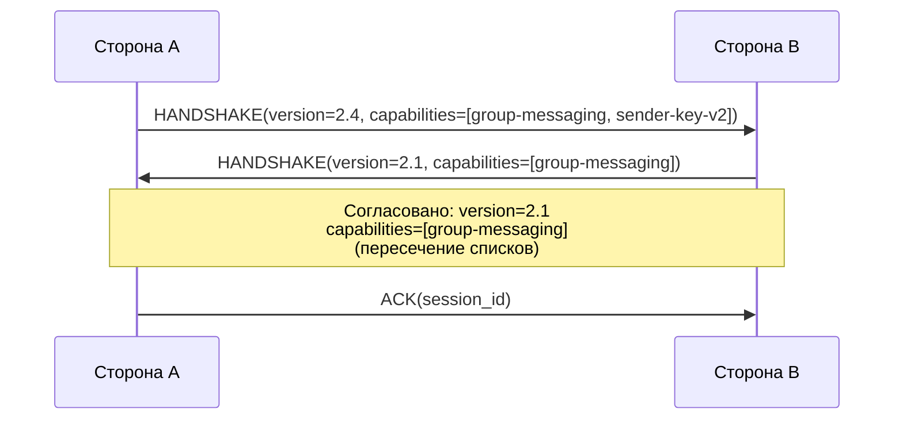
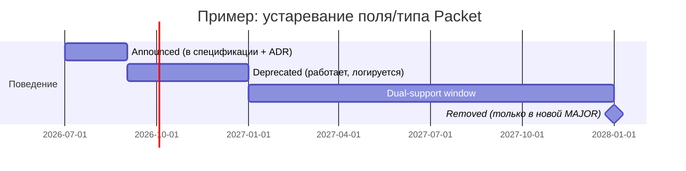

# 0204. Версионирование и политика устаревания протокола

## Статус
Черновик

## Назначение
[0200_PROTOCOL.md](0200_PROTOCOL.md) вводит схему `MAJOR.MINOR` в общих
чертах. Этот документ детализирует, как именно согласуются версии при
подключении, как объявляется устаревание, и какой процесс обязателен перед
удалением любого существующего поведения (Backward Compatibility, API as
Contract, [[0003_ENGINEERING_PRINCIPLES]]).

## Версионная схема
- `MAJOR` — несовместимое изменение формата Packet или семантики обязательного поля. Требует нового согласования на handshake; сторона, не поддерживающая `MAJOR`, обязана отклонить соединение с явным кодом ошибки, а не пытаться угадать поведение.
- `MINOR` — обратно совместимое дополнение в рамках того же `MAJOR` (новое необязательное поле, новый тип Packet, новая Capability). Сторона, не знающая о `MINOR`-дополнении, обязана корректно работать, игнорируя его.

## Согласование возможностей (Capability negotiation)
Выполняется на этапе handshake (см. [0200_PROTOCOL.md](0200_PROTOCOL.md) →
Установление соединения) по следующему алгоритму:

1. Каждая сторона передаёт наибольший поддерживаемый `MAJOR.MINOR` и список строковых идентификаторов Capability (например, `group-messaging`, `sender-key-v2`, `discovery-psi`).
2. Согласованная версия — это наибольший `MAJOR`, общий для обеих сторон; в его рамках — наименьший `MINOR` из двух заявленных (гарантирует, что обе стороны реально поддерживают согласованный набор функций).
3. Согласованные Capability — пересечение (intersection) двух списков. Функциональность, зависящая от отсутствующей в пересечении Capability, отключается для этой Session без разрыва соединения (например, группа продолжает работать без `sender-key-v2`, откатываясь на предыдущую версию групповой схемы, если она есть в общем пересечении).
4. Если общего `MAJOR` не существует — соединение отклоняется на этапе handshake с кодом ошибки, указывающим минимальную поддерживаемую версию инициатора (см. [0800_API.md](0800_API.md) → Обработка ошибок).

## Процесс устаревания
Ни одно уже опубликованное поведение не удаляется одним шагом. Обязательные
стадии:

1. **Announced** — устаревание описано в спецификации и зафиксировано ADR; поведение полностью работает как раньше.
2. **Deprecated** — реализации обязаны продолжать поддерживать старое поведение, но могут сигнализировать о его использовании (лог/метрика, см. [0900_DEVOPS.md](0900_DEVOPS.md) → Observability), чтобы операторы успели обновиться.
3. **Dual-support window** — старое и новое поведение поддерживаются одновременно не менее одного полного цикла между `MAJOR`-релизами (референс: не менее 12 месяцев), чтобы разнородная сеть независимых операторов (Federation) успела мигрировать без принудительной синхронной остановки.
4. **Removed** — старое поведение удаляется только в новой `MAJOR`-версии, никогда внутри `MINOR`.

## Стратегия миграции при MAJOR-релизе
- Изменения формата предпочтительно вносятся так, чтобы старые и новые узлы могли работать в одной сети во время rolling-обновления (см. [0900_DEVOPS.md](0900_DEVOPS.md) → CI/CD) — резкая одновременная остановка всей федеративной сети невозможна и не рассматривается как вариант.
- Новая `MAJOR`-версия обязана явно перечислять все несовместимые изменения относительно предыдущей в отдельном разделе спецификации и в ADR.
- Protocol conformance suite (см. [0500_CORE.md](0500_CORE.md)) обновляется вместе со спецификацией и покрывает как минимум по одному тесту на каждое несовместимое изменение.

## Пример: MINOR vs MAJOR
- Добавление нового необязательного поля `reply_to` в `MESSAGE` Packet — `MINOR`: старые реализации игнорируют неизвестное поле (см. [0201_PACKETS.md](0201_PACKETS.md)), новые используют его при наличии.
- Изменение семантики поля `packet_id` с 64-битного на 128-битный идентификатор — `MAJOR`: старые реализации не могут корректно интерпретировать значение большего размера, требуется полное согласование версии и период параллельной поддержки обоих форматов.

## Связанные документы
- [0200_PROTOCOL.md](0200_PROTOCOL.md)
- [0201_PACKETS.md](0201_PACKETS.md)
- [ADR](ADR/README.md)
