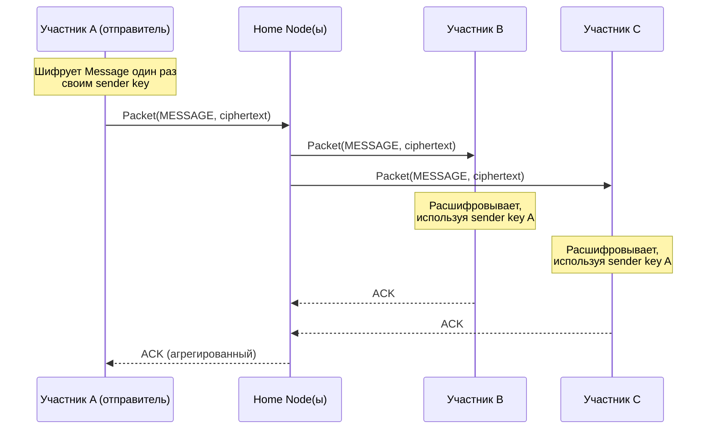

# 0301. Групповая криптосхема (Group Messaging)

## Статус
Черновик

## Назначение
[0300_CRYPTO.md](0300_CRYPTO.md) описывает E2EE для Conversation между
двумя участниками (парный X3DH + Double Ratchet). Групповая Conversation
(несколько получателей одного Message) требует отдельной схемы — попарный
Double Ratchet между каждой парой участников группы не масштабируется:
для группы из N участников потребовалось бы N×(N-1) независимых сессий и
пересчёт при каждом сообщении.

Этот документ фиксирует, как решается доставка одного зашифрованного
Message многим получателям без потери свойств E2EE (Security by Design,
[[0003_ENGINEERING_PRINCIPLES]]) и без изобретения новой криптографии
(используется общепринятая конструкция — sender keys, применяемая в
Signal Protocol и его производных для групп).

## Модель
Группа — это Conversation ([[0004_GLOSSARY]]) с более чем двумя
участниками. Каждый участник:
- поддерживает попарную Session (X3DH + Double Ratchet, см. [0300_CRYPTO.md](0300_CRYPTO.md)) с каждым другим участником — используется только для распространения групповых ключей, а не для самих сообщений;
- поддерживает один **sender key** — симметричный ключ цепочки, из которого он выводит ключи для шифрования собственных исходящих сообщений в эту группу.

## Отправка сообщения в группу
1. Отправитель шифрует Message один раз своим текущим sender key (а не по одному разу на каждого получателя).
2. Зашифрованное сообщение упаковывается в Packet и рассылается всем участникам группы через обычный механизм маршрутизации (см. [0203_ROUTING.md](0203_ROUTING.md)) — Node не выполняет fan-out на уровне контента, каждому получателю доставляется идентичный шифротекст.
3. Каждый получатель хранит sender key каждого другого участника и расшифровывает сообщение локально, продвигая цепочку этого отправителя.

Это даёт O(1) операций шифрования на отправленное сообщение вместо O(N).

## Диаграмма: рассылка сообщения в группу из трёх участников

## Распространение sender key
Sender key нового или ротированного ключа распространяется каждому
участнику индивидуально через уже существующую попарную Session (тот же
Double Ratchet, что используется для приватной переписки один-на-один).
Sender key никогда не передаётся через Node в открытом виде и никогда не
проходит через групповой Packet без индивидуального шифрования для
конкретного получателя.

## Изменение состава группы
- **Добавление участника.** Новому участнику индивидуально передаются sender key всех текущих участников (через попарные Session). Он не может расшифровать историю переписки до момента присоединения, если только существующие участники явно не решат передать ему исторические ключи (forward secrecy группы по умолчанию: новый участник не видит прошлое).
- **Удаление участника.** Каждый оставшийся участник обязан сгенерировать новый sender key и распространить его всем оставшимся участникам заново — старый sender key считается скомпрометированным по определению (удалённый участник мог его сохранить). Это единственный способ гарантировать post-compromise security группы: без ротации удалённый участник продолжал бы читать переписку.

## Компромиссы
- Ротация sender key при каждом удалении участника — операция O(N) попарных сообщений, что дороже, чем в приватной переписке один-на-один. Это принятый компромисс: альтернатива (не ротировать ключ при удалении) нарушает Privacy First для оставшихся участников.
- Forward secrecy внутри одной цепочки sender key слабее, чем в парном Double Ratchet: компрометация текущего состояния цепочки одного участника раскрывает его будущие сообщения в группе до следующей ротации, а не только следующее сообщение. Более частая ротация уменьшает окно риска ценой дополнительного трафика — конкретный интервал ротации является параметром реализации.
- Схема не защищает от участника группы, пересылающего расшифрованные сообщения за пределы E2EE-периметра (это фундаментальное ограничение любой схемы группового шифрования, а не недостаток конкретной реализации).

## Статус готовности
Эта схема требует независимого криптографического аудита перед
стабилизацией `MAJOR`-версии протокола, поддерживающей группы (см.
[ADR-0002](ADR/0002-e2ee-scheme-x3dh-double-ratchet.md) и
[0302_THREAT_MODEL.md](0302_THREAT_MODEL.md)).
