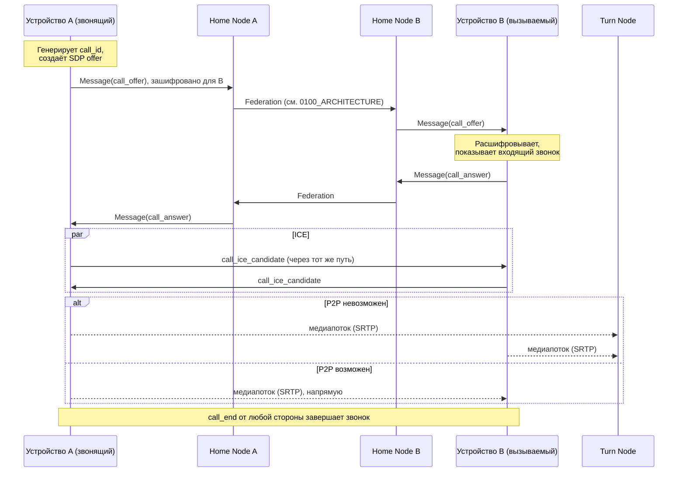

# 0303. Звонки (Calls)

## Статус
Черновик

## Назначение
[ADR-0005](ADR/0005-reuse-legacy-projects-and-real-crypto.md) вывел звонки
(WebRTC) за пределы первого среза и явно отметил пробел: звонки не были
специфицированы отдельным документом. Этот документ закрывает пробел —
описывает, как аудио/видеозвонок устанавливается между двумя Identity,
которые могут обслуживаться разными Home Node (Federation,
[[0004_GLOSSARY]]), без нового класса инфраструктуры для самого сигналинга.

Звонок — это не Conversation (см. [[0004_GLOSSARY]]) и не Message: это
отдельная по времени жизни сессия установления медиапотока (WebRTC
PeerConnection) между двумя устройствами. Сигналинг — обмен служебной
информацией (offer/answer/ICE-кандидаты), нужной, чтобы эту сессию
установить.

## Модель
Звонок инициируется в рамках уже существующей 1:1 Conversation ([0300_CRYPTO.md](0300_CRYPTO.md)) между
вызывающим и вызываемым — групповые звонки, звонки без предварительной
переписки и multi-device одновременный приём вызова вне области этого
документа (см. Не входит в MVP).

## Сигналинг: поверх существующего E2EE-канала
Сигналинг звонка не вводит новый транспорт и не проходит через Node в
открытом виде. Вместо этого используется тот же приём, что уже принят для
распространения группового sender key (см. [0301_GROUP_MESSAGING.md](0301_GROUP_MESSAGING.md) →
Распространение sender key): служебное сообщение шифруется в рамках уже
установленной попарной Session (X3DH + Double Ratchet) и доставляется как
обычный Message с зарезервированным типом содержимого,
непрозрачным для Node.

Следствие: сигналинг звонка автоматически наследует всю уже работающую
маршрутизацию сообщений — доставку в рамках одного Home Node, федерацию
Home Node ↔ Home Node, когда абоненты на разных нодах, и Relay Node как
fallback при недоступности прямой доставки (см. [0202_DELIVERY.md](0202_DELIVERY.md),
[0203_ROUTING.md](0203_ROUTING.md)). Никакой отдельный call-signaling-сервис
или новый тип узла для этого не нужен — ровно то же свойство, из-за
которого множество Home Node/Relay Node на пути сообщения не требует
изменений в клиентской логике сигналинга.

Node (Home/Relay/Storage), пересылающие такое сообщение, видят его ровно
как любой другой Message — opaque ciphertext. Ни SDP (offer/answer), ни
ICE-кандидаты, ни факт того, что это именно сигналинг звонка, а не текст,
Node не раскрываются (Privacy First).

### Служебные подтипы сообщения сигналинга
Внутри расшифрованного содержимого Message вводится закрытый набор
подтипов (аналогично `sender_key_distribution` для групп):

| Подтип | Назначение |
|---|---|
| `call_offer` | инициация звонка: SDP offer, тип (audio/video), идентификатор звонка (`call_id`) |
| `call_answer` | SDP answer от вызываемого |
| `call_ice_candidate` | один ICE-кандидат (отправляется потоком по мере обнаружения, не единым пакетом) |
| `call_reject` | вызываемый отклонил звонок |
| `call_cancel` | вызывающий отменил звонок до ответа |
| `call_end` | любая из сторон завершила установленный звонок |
| `call_busy` | вызываемый уже находится в другом звонке |

Каждое такое сообщение — обычный Message с обычной доставкой; отдельного
ACK/ретрай-протокола для сигналинга не вводится, повторная доставка и
дедупликация — те же механизмы, что и для остальных Message
([0202_DELIVERY.md](0202_DELIVERY.md)).

`call_id` — 128-bit UUID, генерируется вызывающей стороной, живёт от
`call_offer` до `call_end`/`call_reject`/`call_cancel`. Он не заменяет
`packet_id`/`session_id` протокола ([0201_PACKETS.md](0201_PACKETS.md)) — это
идентификатор уровня приложения, нужный обеим сторонам, чтобы сопоставить
несколько сигнальных сообщений одному звонку.

### Что не хранится
`call_signaling`-сообщения не являются частью истории переписки:
клиент не показывает их как Message в UI чата и не обязан хранить их
дольше времени жизни звонка. Storage Node буферизует их наравне с любым
другим Message для офлайн-получателя (TTL, см. [0602_STORAGE_NODE.md](0602_STORAGE_NODE.md)) — если
вызываемый был offline дольше TTL, `call_offer` устаревает и должен
игнорироваться клиентом при получении (пропущенный звонок), а не
инициировать соединение постфактум.

## Медиапотоки: WebRTC + TURN
Сам аудио/видео поток (SRTP) идёт по WebRTC PeerConnection напрямую между
устройствами, когда P2P возможен. Когда прямое соединение недоступно
(NAT/симметричный NAT, строгий firewall), поток проходит через TURN —
новый тип узла, **Turn Node** (см. [0605_TURN_NODE.md](0605_TURN_NODE.md)), а не через
Relay Node: Relay Node пересылает протокольные Packet с сообщениями,
а не непрерывный медиапоток реального времени — смешение этих двух ролей
нарушило бы Single Responsibility ([[0003_ENGINEERING_PRINCIPLES]]).

Адрес(а) доступных Turn Node передаются клиенту так же, как клиент узнаёт
о доступных Relay Node — через Discovery Node (Capability, [[0004_GLOSSARY]]).
STUN используется в первую очередь (референсные публичные STUN-серверы
допустимы, т.к. STUN не передаёт содержимое медиа — только helping
установить P2P-адрес); TURN — обязательный fallback для звонков за
NAT/firewall, где P2P недостижим.

Turn Node не имеет доступа к ключам сессии DTLS-SRTP (они согласуются
end-to-end между устройствами через тот же сигналинг, что offer/answer) —
Turn Node видит непрозрачный зашифрованный медиапоток, аналогично тому, как
Relay Node не видит содержимое Message.

## Устойчивость соединения: временные проблемы сети не должны рвать звонок
WebRTC ICE-соединение реального времени по природе нестабильно на плохой
сети (мобильный роуминг, смена Wi-Fi/LTE, кратковременная потеря пакетов)
— это ожидаемо, а не аварийная ситуация. ICE-соединение имеет собственную
модель состояний (`checking` → `connected` → `disconnected` → `failed`/
`connected` заново), и только часть этих состояний означает, что звонок
действительно нужно завершать:

| ICE-состояние | Что это значит | Реакция клиента |
|---|---|---|
| `disconnected` | Временная потеря связности (пакеты не проходят прямо сейчас) — может восстановиться сама в течение секунд | **Не завершать звонок.** UI переходит в состояние «ожидание сети» (см. ниже), медиапоток приостанавливается, `call_end` не отправляется |
| `connected` (повторно, после `disconnected`) | Связность восстановилась | UI возвращается в обычное состояние звонка |
| `failed` | ICE не смог восстановить путь (в т.ч. после исчерпания времени ожидания в `disconnected`) | Звонок реально завершается — см. ниже |

Конкретно:
- При переходе в `disconnected` клиент **не отправляет `call_end`** и не
  разрывает сигнальную сессию — только показывает индикатор «ожидание
  сети» в UI (см. `ActiveCall`, где для этого предусмотрено отдельное
  состояние соединения, не переиспользующее `answered`/`outgoing`).
- Даётся таймаут ожидания восстановления (референс: 15–30 секунд —
  конкретное значение не фиксируется этим документом, это параметр
  реализации, аналогично интервалу ротации sender key в
  [0301_GROUP_MESSAGING.md](0301_GROUP_MESSAGING.md) → Компромиссы).
- Если за это время ICE не вернулся в `connected` (то есть перешёл в
  `failed` или таймаут истёк) — клиент завершает звонок как обычно
  (`call_end`), это уже реальный обрыв, а не временная деградация.
- ICE restart (повторное согласование путей без пересоздания всего звонка)
  — механизм WebRTC для попытки восстановления до истечения таймаута;
  использовать его до объявления `failed`, а не сразу переходить к
  `call_end`.

Это касается именно медиа-уровня (ICE/PeerConnection). Сигнальный уровень
(доставка `call_*`-сообщений через Home Node/Relay Node, см. выше) уже и
так устойчив к кратковременной недоступности — Message ставится в очередь
и доставляется при восстановлении сети или через Storage Node buffer
(тот же механизм, что и для обычных сообщений), поэтому дополнительной
логики на уровне сигналинга не требуется — риск обрыва звонка на «мелочи»
находится именно в медиа-слое, не в сигналинге.

## Диаграмма: установление звонка между абонентами на разных Home Node

## Не входит в MVP
- Групповые звонки (несколько участников в одном звонке) — требуют SFU
  или mesh-топологию поверх текущей схемы, отдельное проектирование.
- Приём звонка одновременно на нескольких устройствах одного пользователя
  (multi-device call fan-out) — сигналинг сейчас адресован Identity
  получателя через его текущую Session, не per-device fan-out.
- Запись звонков, история звонков на backend (только локальный журнал на
  клиенте, если будет реализован).
- Push-уведомление о входящем звонке, когда приложение не в foreground —
  зависит от push-инфраструктуры, вне текущего документа.

## Статус готовности
Схема сигналинга наследует состояние готовности [0300_CRYPTO.md](0300_CRYPTO.md) и
[0301_GROUP_MESSAGING.md](0301_GROUP_MESSAGING.md) (обе — черновик, требуют независимого
криптографического аудита перед стабилизацией `MAJOR`-версии протокола).
Turn Node — новый компонент, требует собственной проработки безопасности
(rate limiting, защита от использования как open relay для стороннего
трафика) перед эксплуатацией вне тестового окружения — см.
[0605_TURN_NODE.md](0605_TURN_NODE.md) → Ограничения.
