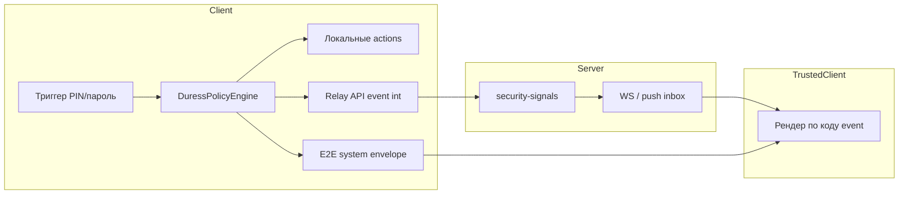

# 0404. Политики принуждения (Duress Policy)

## Статус
Черновик — структурирование требований (2026-07-07)

## Назначение
Единая модель **локальных политик безопасности** для сценариев принуждения:
decoy PIN, неверный основной PIN, секретная комната, блокировки и оповещения
доверенных лиц.

Отдельно от:
- **[[0402_PRIVATE_MODE]]** — уровни доступа (Normal / Decoy / Private);
- **[[0403_SECRET_CHAT_SESSION]]** — секретные сообщения внутри чата.

Этот документ описывает **что происходит при каком событии**, как политики
хранятся на устройстве (зашифрованно), и как клиент **сигнализирует на сервер**
без передачи текста или смысла события в открытом виде.

---

## Принципы

1. **Сервер не знает контекст** — только числовой код события + список user id
   получателей (если нужно). Никакого текста «пользователь в опасности» на API.
2. **Политики локальны и зашифрованы** — как vault Private Mode; без основного
   PIN политики не читаются и не настраиваются.
3. **Прогрессивное раскрытие UI** — экран политик виден только после настройки
   основного PIN; decoy/fake нигде не называется «обманным» в обычном UI.
4. **Decoy-режим никогда не открывает секрет** — секретная комната, скрытые чаты,
   расшифровка secret-сообщений недоступны (см. [[0402_PRIVATE_MODE]]).
5. **Доставка многоуровневая** — одно событие может запускать несколько каналов
   (локально, E2E-сигнал в чат, server relay), каждый настраивается отдельно.

---

## Типы событий (триггеры)

Событие — факт на клиенте в момент ввода PIN/пароля. Обработчик не угадывает
намерение; он сопоставляет событие с **политикой** и **счётчиками**.

| ID | Код (внутр.) | Когда возникает |
|----|--------------|-----------------|
| `E0` | `pin_unlock_ok_real` | Успешный основной PIN → Private Mode |
| `E1` | `pin_unlock_ok_decoy` | Успешный дополнительный (decoy) PIN |
| `E2` | `pin_unlock_fail` | Неверный PIN (ни основной, ни decoy) |
| `E3` | `pin_unlock_fail_streak` | N-й подряд неверный PIN (порог из политики) |
| `E4` | `decoy_pin_streak` | N-й подряд decoy PIN за сессию/период |
| `E5` | `secret_room_activate_ok` | Успешная активация секретной комнаты в чате |
| `E6` | `secret_room_activate_fail` | Попытка `пароль␠␠`, пароль не совпал |
| `E7` | `app_lock_fail` | Неверный PIN на экране блокировки приложения |
| `E8` | `panic_exit` | Panic exit из Private Mode |
| `E9` | `emergency_lock` | Экстренная блокировка (см. Emergency Lock) |

Для сервера используются **только числовые коды** из таблицы «Коды relay» ниже —
не строковые `pin_duress_hint` из MVP-чата.

---

## Коды relay (сервер)

Клиент отправляет **одну команду** на Home/Gateway. Тело — opaque для сервера.

### Запрос (черновик API)

```
POST /v1/security-signals
Authorization: Bearer <access_token>
Content-Type: application/json

{
  "event": <int>,           // код события, см. таблицу
  "targets": [<user_id>...] // опционально; пусто = только серверный audit
}
```

Сервер:
- **не расшифровывает** смысл (знает только номер `event`);
- **не хранит** текст;
- маршрутизирует получателям **тот же числовой код** (push/WebSocket/inbox),
  если `targets` не пуст;
- может применять rate limit per device.

### Таблица кодов `event`

| Код | Имя (документация) | Типичный смысл для получателя |
|-----|-------------------|-------------------------------|
| `10` | `WARN_PIN_ACTIVITY` | Подозрительная активность PIN (неверные попытки) |
| `20` | `WARN_DECOY_USED` | Использован дополнительный PIN |
| `30` | `DANGER_POSSIBLE` | Возможное принуждение (порог decoy / политика) |
| `40` | `DANGER_CONFIRMED` | Повторяющееся / критическое событие |
| `50` | `LOCAL_LOCKOUT` | *(только локально, на сервер не шлётся)* |
| `60` | `SECRET_PURGE_REQUEST` | *(только локально)* — удалить secret-сообщения |
| `90` | `HEARTBEAT_OK` | Тест доставки / «всё в порядке» (опционально) |

Маппинг **триггер → код relay** задаётся в политике пользователя, не захардкожен
в одном месте (но есть **заводские пресеты**).

---

## Действия (actions)

Одна политика на событие (или на порог счётчика) может включать несколько действий:

| Action | Где выполняется | Описание |
|--------|-----------------|----------|
| `A0` `none` | — | Только локальный журнал |
| `A1` `lock_pin_ui` | Локально | Блокировка ввода PIN на N секунд (напр. 5 мин) |
| `A2` `lock_app` | Локально | Полная блокировка приложения на N секунд |
| `A3` `notify_trusted_chat` | E2E | Техн. сообщение в личный чат (клиент рендерит по `system` + коду) |
| `A4` `relay_event` | Сервер | `POST /v1/security-signals` с `event` + `targets` |
| `A5` `purge_secret_messages` | Локально | Удалить все secret-сообщения на устройстве |
| `A6` `wipe_private_vault` | Локально | Очистить Private Mode vault (опасно, opt-in) |
| `A7` `deactivate_secret_sessions` | Локально | Сбросить секретные сессии во всех чатах |
| `A8` `show_decoy_only` | UI | Перейти в decoy / fake UI (уже есть) |
| `A9` `increment_counter` | Локально | Увеличить streak-счётчик (для порогов 3/5/…) |

Действия выполняются **в порядке возрастания приоритета** (сначала lockout, потом
notify, потом purge — настраивается).

---

## Пресеты (примеры для UI)

Пользователь выбирает пресет или «свой»; пресет — набор правил.

### P1 «Минимальный»
| Триггер | Порог | Действия |
|---------|-------|----------|
| `pin_unlock_fail` | 5 подряд | `lock_pin_ui` 5 мин |
| `decoy_pin_streak` | 1 | `show_decoy_only` |
| остальное | — | `none` |

### P2 «С доверенными» (близко к текущему MVP)
| Триггер | Порог | Действия |
|---------|-------|----------|
| `decoy_pin_streak` | 1 | `notify_trusted_chat` (код UI `hint`), `relay_event` 20 |
| `decoy_pin_streak` | 3 | `notify_trusted_chat` (alert), `relay_event` 30 |
| `decoy_pin_streak` | 5 | `purge_secret_messages`, `relay_event` 40 |
| `pin_unlock_fail` | 3 подряд | `notify_trusted_chat` (hint), `relay_event` 10 |
| `pin_unlock_fail` | 5 подряд | `lock_pin_ui` 5 мин |

### P3 «Параноидальный»
| Триггер | Порог | Действия |
|---------|-------|----------|
| `pin_unlock_fail` | 1 | `relay_event` 10 (без UI у доверенных) |
| `pin_unlock_fail` | 3 | `lock_pin_ui` 15 мин + `relay_event` 30 |
| `decoy_pin_streak` | 1 | `purge_secret_messages` + `relay_event` 40 |
| `secret_room_activate_fail` | 3 | `relay_event` 10 |

### P4 «Тихий decoy»
| Триггер | Порог | Действия |
|---------|-------|----------|
| `decoy_pin_streak` | любой | только `show_decoy_only` |
| `pin_unlock_fail` | 10 | `lock_pin_ui` 1 мин |
| уведомления доверенным | выкл | — |

---

## Доверенные лица

| Поле | Хранение | Описание |
|------|----------|----------|
| `trusted_user_ids` | В зашифрованной политике | UUID пользователей |
| `min_direct_chat` | Политика | Уведомлять только если есть 1:1 чат |
| `channels` | Политика | `chat` / `relay` / `both` |

**Неверный PIN (E2)** — отдельное правило в политике:
- «уведомлять доверенных о неверных попытках» — opt-in (по умолчанию выкл в P1,
  вкл в P2 после 3-й попытки);
- получатель видит **мелкий баннер в чате** (не push с текстом), если политика
  разрешает `notify_trusted_chat`;
- параллельно может уйти `relay_event` 10 без расшифровки на сервере.

---

## Хранение политик (локально, зашифровано)

### Контейнер `duress_policy.v1`

Аналогично `hidden_vault.v1` ([[0402_PRIVATE_MODE]]):
- ключ = Argon2id(основной PIN, salt);
- AES-GCM;
- файл неотличим от случайных данных без PIN.

### Схема JSON (внутри ciphertext)

```json
{
  "v": 1,
  "preset_id": "P2",
  "trusted_user_ids": ["uuid", "..."],
  "trusted_channels": ["chat", "relay"],
  "rules": [
    {
      "trigger": "decoy_pin_streak",
      "threshold": 1,
      "window_sec": 86400,
      "actions": [
        { "type": "notify_trusted_chat", "ui_code": 1 },
        { "type": "relay_event", "event": 20 }
      ]
    },
    {
      "trigger": "pin_unlock_fail",
      "threshold": 5,
      "window_sec": 300,
      "actions": [
        { "type": "lock_pin_ui", "duration_sec": 300 }
      ]
    }
  ],
  "counters": {
    "pin_unlock_fail": { "count": 0, "window_start": "ISO8601" }
  }
}
```

`counters` персистятся в том же файле (или отдельный encrypted blob) — чтобы
streak переживал перезапуск приложения в пределах `window_sec`.

### До настройки основного PIN
- файла политики **нет**;
- `TrustedContactsStore` / MVP-счётчики мигрируют в vault при первом сохранении PIN.

---

## Каналы доставки



| Канал | Плюсы | Минусы |
|-------|-------|--------|
| **Локально** | Мгновенно, офлайн | Только на этом устройстве |
| **E2E chat** | Доверенный видит в контексте чата | Нужен чат + доставка сообщений |
| **Server relay** | Работает при офлайне получателя (push) | Нужен endpoint; сервер видит факт сигнала |

**Рекомендация:** для критичных кодов `30`/`40` — `both` (chat + relay); для `10` —
только chat или только relay по выбору пользователя.

### E2E envelope для чата (клиент)

Расширение `MessagePayload` (не меняет API сообщений):

```json
{
  "v": 1,
  "system": "duress",
  "code": 10,
  "ts": "ISO8601"
}
```

UI получателя: таблица `code → строка` **только на клиенте**; тексты не в ciphertext
смысловые (можно даже пустой `body`).

---

## UI настройки (после основного PIN)

Экран **«Политика безопасности»** внутри Private Mode (не в обычных настройках):

1. **Пресет** — P1…P4 + «Своя»
2. **Доверенные контакты** — из чатов / по User ID
3. **Правила** (advanced) — таблица триггер → порог → действия
4. **Тест** — «Проверить доставку» → `relay_event` 90 + тестовый баннер себе в «Избранное»

В обычном UI:
- «Дополнительный PIN» — без слова fake;
- нет упоминания purge/relay до входа в Private Mode.

---

## Связь с текущим MVP (код)

| Сейчас | Целевое |
|--------|---------|
| `FakePinDuressService` + фикс. пороги 1/3/5 | `DuressPolicyEngine` + правила из vault |
| `TrustedContactsStore` (plain prefs) | внутри `duress_policy.v1` |
| `pin_duress_hint` / `alert` в plaintext | `system: duress` + `code: int` |
| Нет server relay | `POST /v1/security-signals` |
| Нет lockout на неверный PIN | `A1 lock_pin_ui` по политике |
| Decoy блокирует secret room | без изменений |

---

## Фазы реализации

### Фаза 1 — Движок локально (без сервера)
- [x] `DuressPolicyEngine` + encrypted store
- [x] Миграция MVP-счётчиков и trusted list
- [x] Пресеты P1–P4
- [x] Lockout 5 мин на `pin_unlock_fail`
- [x] UI политик в Private Mode

### Фаза 2 — E2E унификация
- [x] Единый `system: duress` + numeric `code`
- [x] Рендер у доверенных по коду (`DuressSignalBanner`)
- [x] Неверный PIN → opt-in уведомление доверенным
- [x] UI каналов chat / relay / оба

### Фаза 3 — Server relay
- [x] Спека endpoint в [[0800_API]]
- [x] Home: приём, fan-out по `targets`, WS/push с `event` int
- [x] Клиент: `SecuritySignalClient.relay(event, targets)`
- [x] Fallback на E2E-chat при сбое relay

### Фаза 4 — Advanced
- [x] Окна времени (`window_sec`) в движке + редактор
- [x] Per-rule каналы chat/relay/both
- [x] Аудит локально + «последний отправленный код» в Security Dashboard
- [x] Rate limit relay на клиенте (30/час) и сервере (60/час)
- [x] Пресет «Своя» + редактор правил

---

## Открытые вопросы

1. **Групповые чаты** — уведомлять доверенных только в 1:1 или разрешить «тихий»
   канал в группе с доверенным админом?
2. **Rate limit** — не спамить relay при brute-force (макс. N событий / час)?
3. **Получатель без нашего клиента** — server push с opaque `event`; сторонний
   клиент увидит только число (документировать в API).
4. **Синхронизация политик между устройствами** — **нет** (как PIN); каждое
   устройство настраивается отдельно.

---

## Связанные документы
- [[0402_PRIVATE_MODE]]
- [[0403_SECRET_CHAT_SESSION]]
- [[0302_THREAT_MODEL]]
- [[0800_API]] — `security-signals` (фаза 3)
