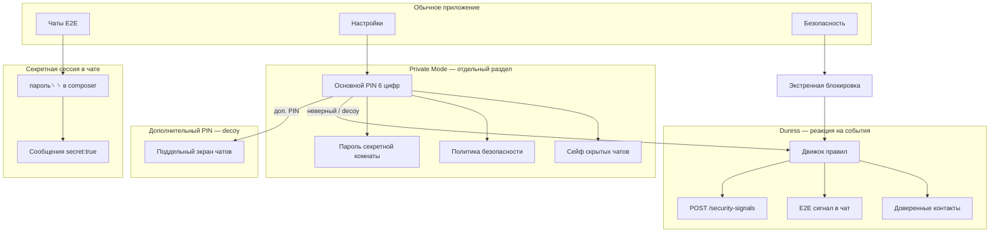

# 0410. База знаний: приватность и безопасность (клиент)

## Статус
Живой документ — 2026-07-07. Для людей, не только для разработчиков.

## Зачем этот файл
В приложении несколько **независимых, но связанных** механизмов. Их легко перепутать:

| Часто путают | На самом деле |
|--------------|---------------|
| Private Mode и «секретная комната в чате» | Разные вещи |
| Дополнительный PIN и политика duress | PIN — вход; duress — что делать после события |
| Скрытый чат в списке и vault в Private Mode | Два разных способа спрятать переписку |

Ниже — одна карта: **что есть**, **как работает**, **куда нажимать**.

---

## Карта системы (одним взглядом)



---

## Три столпа

### 1. Private Mode (защищённый раздел)

**Что это:** отдельный «сейф» внутри приложения. Свой PIN, свои настройки, локальное хранилище.

**Зачем:** спрятать раздел приложения и локальные данные от постороннего, кто открыл телефон.

| Элемент | Описание |
|---------|----------|
| **Основной PIN** | 6 цифр, Argon2id. Без него нет Private Mode и «опасных» настроек в UI |
| **Дополнительный PIN** | В UI называется так, без слова «fake». Открывает **decoy** — поддельный экран |
| **Сейф (vault)** | Локальные «скрытые чаты» (не серверные треды). Файл `hidden_vault.v1`, AES-GCM |
| **Скрытые чаты (2 вида)** | (а) чат убран из списка через реестр ID; (б) чаты внутри vault |
| **Panic exit** | Кнопка ✕ — мгновенный выход в обычное приложение, блокировка сейфа |

**Как войти:** Настройки → Конфиденциальность / Блокировка и PIN → ввод PIN.

**Прогрессивное раскрытие:** до настройки PIN пользователь видит только «настроить блокировку». Политика duress, секретная комната, опасные опции — **после** входа в Private Mode.

**Спека:** [[0402_PRIVATE_MODE]]

---

### 2. Секретная сессия в чате («секретная комната»)

**Что это:** временный режим **внутри обычного 1:1 или группового чата**. Сервер и API **не меняются** — флаг `secret: true` только внутри E2E-текста.

**Зачем:** спрятать часть переписки в уже существующем чате, пока вы в нём и знаете пароль.

| Правило | Поведение |
|---------|-----------|
| Включение | В поле сообщения: `пароль` + **два пробела** + Enter. Текст **не отправляется** |
| Выключение | Выход в список чатов, таймер бездействия, кнопка замка |
| Видимость | Без режима — secret-сообщения **скрыты**. В режиме — видны обычные + secret |
| У собеседника | То же: видит secret только если **сам** включил режим в этом чате |
| Push / превью | Для secret — **никогда** |
| Пароль | Задаётся в Private Mode → Секретная комната. Отдельный от PIN |

**Важно:** decoy-режим **блокирует** активацию секретной комнаты.

**Спека:** [[0403_SECRET_CHAT_SESSION]]

---

### 3. Политика duress (принуждение)

**Что это:** автоматические **действия** при событиях безопасности (неверный PIN, decoy, panic и т.д.).

**Зачем:** при принуждении — тихо предупредить доверенных, заблокировать ввод, очистить secret-данные.

**Сервер не знает смысл** — только числовой код события (10, 20, 30, 40, 90…).

#### Пресеты (готовые шаблоны)

| ID | Название | Суть |
|----|----------|------|
| **P1** | Минимальный | Lockout после 5 ошибок; decoy без уведомлений |
| **P2** | С доверенными | **По умолчанию.** Decoy → сигнал 20; 3× decoy → 30; 5× → purge + 40 |
| **P3** | Параноидальный | Агрессивные relay и ранняя очистка |
| **P4** | Тихий decoy | Только decoy UI, без оповещений |
| **Своя** | Custom | Свой список правил в редакторе |

#### События (триггеры)

| Событие | Когда |
|---------|-------|
| Неверный основной PIN | Не совпал ни основной, ни дополнительный |
| Дополнительный PIN (decoy) | Успешный decoy PIN |
| Неверный пароль секретной комнаты | `пароль␠␠` не совпал |
| Неверный PIN блокировки приложения | App Lock overlay |
| Быстрый выход (panic) | Кнопка ✕ в Private Mode |
| Экстренная блокировка | Security Dashboard → Экстренная блокировка |

#### Действия (что может сделать правило)

| Действие | Где |
|----------|-----|
| Блокировка ввода PIN | Локально, N секунд |
| Уведомить доверенных | E2E-сообщение → баннер в чате |
| Relay | `POST /security-signals` → WS у получателя |
| Удалить secret-сообщения | Локально на устройстве |
| Сброс secret-сессий | Во всех чатах |
| Очистить Private vault | Опасно, по политике |
| Только decoy UI | Уже открыт при decoy PIN |

#### Каналы доставки сигналов

| Канал | Как |
|-------|-----|
| **Чат (E2E)** | Зашифрованное техсообщение `system: duress` + код |
| **Relay** | Сервер пересылает число получателям (без расшифровки) |
| **Оба** | Параллельно |
| **На правило** | В «Своих правилах» можно переопределить канал |

**Настройка:** Private Mode → Политика безопасности (нужен разблокированный сейф в этой сессии).

**Спека:** [[0404_DURESS_POLICY]] · API: [[0800_API]] (security-signals)

---

## Вспомогательные функции

### Блокировка приложения (App Lock)

- Включается в Private Mode → Настройки приватности
- При уходе в фон — полноэкранный PIN при возврате
- Неверный PIN → те же счётчики duress, что и у Private Mode PIN
- **Ограничение:** таймер «автоблокировка через N сек» сохраняется, но **пока не применяется** (блок при любом resume)

### Экстренная блокировка

Путь: **Настройки → Безопасность → Экстренная блокировка**

| Уровень | Эффект |
|---------|--------|
| Мягкая | Завершить другие сеансы, выйти |
| Полная | + блок новых входов, тишина уведомлений |
| Критическая | + wipe ключей, recovery lock |

Всегда запускает duress-триггер `emergency_lock` (по пресету).

### Центр безопасности (Security Dashboard)

Путь: **Настройки → Безопасность**

Локальный статус: ключи, WebSocket, устройства, PIN, vault, последний duress-сигнал, журнал.

**Не утверждает** «вы полностью защищены» — только то, что видит клиент.

### Журнал безопасности

Локальные события: PIN, secret room, duress-сигналы, экстренная блокировка.

---

## Как всё связано (главные правила)

```
1. Decoy PIN  →  поддельный UI  +  secret-сессии ВЫКЛ  +  vault ЗАБЛОКИРОВАН
2. Real PIN   →  Private Mode   +  vault ОТКРЫТ       +  политики duress ДОСТУПНЫ
3. Secret chat  работает в ОБЫЧНЫХ чатах, пароль задаётся в Private Mode
4. Duress       не «включает» decoy — decoy открывается PIN-ом; duress добавляет сигналы/очистку
5. Panic        выход + сброс secret-сессий + (по пресету) сигнал доверенным
```

### Коды сигналов для доверенных (только на их клиенте)

| Код | Смысл в UI |
|-----|------------|
| 10 | Подозрительная активность PIN |
| 20 | Использован дополнительный PIN |
| 30 | Возможное принуждение |
| 40 | Критический сигнал |
| 90 | Тест доставки |

Отображается как **баннер в чате**, не как обычное сообщение.

---

## Навигация (шпаргалка)

```
Настройки
├── Безопасность ..................... Security Dashboard
│   ├── Экстренная блокировка
│   ├── Конфиденциальность ........... Private Mode (PIN)
│   └── Журнал безопасности
└── Конфиденциальность ............... то же, что выше

Private Mode (после основного PIN)
├── Скрытые чаты
├── Политика безопасности ............ пресет, каналы, доверенные, тест
│   └── Свои правила ................. редактор (пресет «Своя»)
├── Настройки приватности ............ toggles, App Lock, decoy PIN
│   └── Секретная комната ............ пароль + таймер
└── Panic ✕

Обычные чаты
├── Долгое нажатие «Чаты» / поиск .скрытые → скрытые (с PIN)
├── Инфо чата → скрыть из списка
└── В composer: пароль␠␠ → секретный режим
```

---

## Что готово / что ещё идеи

### Готово к использованию

- [x] PIN (основной + дополнительный), Argon2id
- [x] Private Mode, vault, скрытые чаты (оба механизма)
- [x] Секретная сессия в чате (MVP по 0403)
- [x] Duress: пресеты P1–P4, «Своя», движок, relay, аудит
- [x] App Lock (без таймера задержки)
- [x] Emergency Lock, Security Dashboard
- [x] Прогрессивное раскрытие UI

### Частично / заглушки

- [ ] Decoy-экран — **статичный** список фейковых чатов
- [ ] Автоблокировка «через N секунд» — настройка есть, логика нет
- [ ] Биометрия — частично
- [ ] В «Своих правилах» коды 10/20/30 и длительность lockout — **фиксированные** (20/20, 5 мин)
- [ ] Forensic-изоляция (отдельное шифрование основного кэша сообщений) — **нет**

### Идеи на будущее (не решено)

- Групповые чаты для duress-сигналов
- Push/inbox для relay, когда получатель офлайн
- Разные правила для уровней Emergency Lock
- Синхронизация политик между устройствами — **не планируется** (как PIN)
- Тестовый сигнал «себе в Избранное»

---

## Глоссарий

| Термин | Коротко |
|--------|---------|
| **Private Mode** | Раздел приложения за основным PIN |
| **Decoy / доп. PIN** | Поддельный вход, выглядит правдоподобно |
| **Vault** | Зашифрованное локальное хранилище в Private Mode |
| **Secret session** | Временный режим в одном чате (`secret: true`) |
| **Duress** | Политика «что делать при тревожном событии» |
| **Доверенный контакт** | Кому уходят сигналы (1:1 чат обязателен) |
| **Relay** | Серверная пересылка **только числа**-кода |
| **Lockout** | Пауза перед следующим вводом PIN |
| **Пресет** | Готовый набор правил P1–P4 |
| **Своя** | Свой набор правил, редактируется вручную |

---

## Связанные документы

| Документ | Содержание |
|----------|------------|
| [[0402_PRIVATE_MODE]] | Private Mode, vault, decoy |
| [[0403_SECRET_CHAT_SESSION]] | Секретная сессия в чате |
| [[0404_DURESS_POLICY]] | Duress, пресеты, API |
| [[0800_API]] | security-signals |
| [[0302_THREAT_MODEL]] | Модель угроз |

---

## Для разработчиков: ключевые файлы

| Область | Путь |
|---------|------|
| Decoy gate | `lib/services/app_privacy_session.dart` |
| PIN | `lib/security/pin_security.dart` |
| Vault | `lib/services/hidden_vault_session.dart` |
| Secret chat | `lib/security/secret_chat_security.dart`, `lib/state/app_controller.dart` |
| Duress engine | `lib/services/duress_policy_engine.dart` |
| Duress models | `lib/models/duress_policy.dart` |
| UI политик | `lib/screens/private_mode/duress_policy_screen.dart` |
| Баннер в чате | `lib/widgets/chat/duress_signal_banner.dart` |
| App Lock | `lib/widgets/app_lock_overlay.dart` |
| Security Dashboard | `lib/screens/security/security_dashboard_screen.dart` |

---

*При изменении поведения обновляйте этот файл вместе с кодом.*
