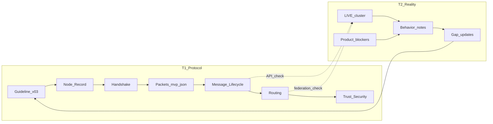

# OUO Development Roadmap

Два параллельных трека. Спека без сверки с LIVE не считается закрытой.  
_Создано: 2026-07-22 · без кода на этапах R0–R5_

Связано:

- [`SERVER-PROTOCOL-GUIDELINE-v0.3.md`](SERVER-PROTOCOL-GUIDELINE-v0.3.md) — ТЗ + gap
- [`reality/`](reality/) — as-is заметки (T2)
- [`../project/spec/`](../project/spec/) — детальные спеки (T1)
- [`AI-HANDOFF.md`](AI-HANDOFF.md) — что LIVE сейчас

---

## Решение

| Правило | Содержание |
|---------|------------|
| Два трека | **T1 Protocol (to-be)** и **T2 Reality (as-is → feedback)** параллельно |
| Sync | Раздел T1 не `done`, пока нет reality-note в T2 |
| Transport LIVE | HTTP/JSON + WS = profile **`mvp-json`**. Protobuf/binary — будущий MAJOR |
| Код | До конца R5 цель — документы. Реализация — отдельное решение после R5 |
| Продукт в T2 | Срочные блокеры (напр. HTTPS для PWA) — только если мешают проверке поведения; иначе product backlog |

---

## Критерий готовности фазы `Rn`

1. Спека / раздел в `project/spec` или Guideline (**T1**).
2. Reality-note «as-is / gaps / confirms» в `docs/reality/` (**T2**).
3. Строка статуса ниже: `done` + дата.

Без пункта 2 фаза **не done**.

Шаблон заметки: [`reality/_TEMPLATE.md`](reality/_TEMPLATE.md).

---

## Статус фаз

| Фаза | Тема | T1 | T2 | Статус |
|------|------|----|----|--------|
| **R0** | Каркас плана + карта LIVE | этот файл | [`reality/R0-live-map.md`](reality/R0-live-map.md) | **done** 2026-07-22 |
| **R1** | Node Record, Bootstrap/Discovery, L0–L5 mapping | [`../project/spec/0205_NODE_RECORD.md`](../project/spec/0205_NODE_RECORD.md) | [`reality/R1-node-bootstrap.md`](reality/R1-node-bootstrap.md) | **done** 2026-07-22 |
| **R2** | Handshake + packets (`mvp-json`) | [`0200`](../project/spec/0200_PROTOCOL.md) / [`0201`](../project/spec/0201_PACKETS.md) | [`reality/R2-wire-today.md`](reality/R2-wire-today.md) | **done** 2026-07-22 |
| **R3** | Message lifecycle + очереди | [`0202`](../project/spec/0202_DELIVERY.md) | [`reality/R3-message-lifecycle.md`](reality/R3-message-lifecycle.md) | **done** 2026-07-22 |
| **R4** | Маршрутизация + смена Home + calls path | [`0203`](../project/spec/0203_ROUTING.md) | [`reality/R4-routing.md`](reality/R4-routing.md) | **done** 2026-07-22 |
| **R5** | Sybil, revocation, metadata, partition, no-Bootstrap | [`0305`](../project/spec/0305_NETWORK_SECURITY_NOTES.md) + Guideline Part III | [`reality/R5-security-as-is.md`](reality/R5-security-as-is.md) | **done** 2026-07-22 |
| **Post-R5** | Точечная реализация под закрытые контракты | — | — | **не начинать** без явного решения |

---

## Фазы подробно

### R0 — Каркас плана

| T1 | T2 |
|----|----|
| `DEVELOPMENT-ROADMAP.md` + якоря на Guideline | Карта LIVE: MAIN/WORKER, роли, critical path |

**Выход:** roadmap + [`reality/R0-live-map.md`](reality/R0-live-map.md).

### R1 — Идентичность ноды и вход в сеть

| T1 | T2 |
|----|----|
| Node Record v1; Bootstrap vs Discovery; mapping L0–L5 ↔ `trust_status` | Сверка Discovery registration; что если Gateway/Discovery down |

**Выход:** [`0205_NODE_RECORD.md`](../project/spec/0205_NODE_RECORD.md) + [`reality/R1-node-bootstrap.md`](reality/R1-node-bootstrap.md).

### R2 — Handshake и пакеты на mvp-json

| T1 | T2 |
|----|----|
| Handshake client↔home, node↔node; семантика Header/Payload/Sig/TTL | Фактический login/device/WS как `mvp-json`; таблица endpoint ≈ packet type |

**Выход:** обновление [`0200`](../project/spec/0200_PROTOCOL.md) / [`0201`](../project/spec/0201_PACKETS.md) + [`reality/R2-wire-today.md`](reality/R2-wire-today.md).

### R3 — Жизненный цикл сообщения и очереди

| T1 | T2 |
|----|----|
| Client → Local → Relay → Remote → ACK → purge; TTL очереди | Путь home/federation/relay as-is; gap TTL/purge/идемпотентность |

**Выход:** уточнение [`0202`](../project/spec/0202_DELIVERY.md) + [`reality/R3-message-lifecycle.md`](reality/R3-message-lifecycle.md).

### R4 — Маршрутизация и смена ноды

| T1 | T2 |
|----|----|
| Выбор маршрута, backup, TTL, notify при смене Home; message vs call path | Resolve/discovery as-is; ADR-0008 calls — только описание |

**Выход:** [`0203`](../project/spec/0203_ROUTING.md) + [`reality/R4-routing.md`](reality/R4-routing.md).

### R5 — Безопасность сети (на бумаге)

| T1 | T2 |
|----|----|
| Sybil, revocation, malicious relay, metadata level, partition, жизнь без Bootstrap | Что enrollment уже даёт; что видно оператору; critical path |

**Выход:** [`0305_NETWORK_SECURITY_NOTES.md`](../project/spec/0305_NETWORK_SECURITY_NOTES.md) + Guideline Part III «на бумаге» + [`reality/R5-security-as-is.md`](reality/R5-security-as-is.md).

---

## Следующий шаг

**Post-R5 (в работе)** — точечная реализация под R1–R5:

| # | Задача | Статус |
|---|--------|--------|
| 1 | Durable outbox + retry federation fail | **done** (home-node `message_outbox`) |
| 2 | Re-enroll после `compromised` | **done** (`POST .../re-enroll` + Admin UI) |
| 3 | `home_updated_at` / previous URL при смене Home | **done** (Discovery API + Home log) |
| 4 | Hop-scoped `participant_user_ids` на federation | **done** (меньше meta на Relay) |
| 5 | Multi-Discovery / backup bootstrap | **done** (client backup Home URLs; full failover/re-auth ещё backlog) |
| 6 | Home resolve cache TTL | **done** (`DISCOVERY_RESOLVE_CACHE_TTL_SECONDS`, default 60) |
| 7 | Buffer drain: WS push before DELETE | **done** |
| 8 | CONTROL notify контактам при смене Home | **done** (`POST /internal/home-changed` + WS) |
| 9 | Semantic e2e ACK | **done** — `POST …/messages/{packet_id}/ack` → `message_delivery_acks` → WS `delivery_ack` / federation; client `MessageDeliveryStatus.delivered` |
| 10 | Ops: `ENROLLMENT_MODE=strict` runbook | **done** → [`ops/ENROLLMENT-STRICT.md`](ops/ENROLLMENT-STRICT.md) |
| 11 | Client failover на backup Home | **done** |
| 12 | Sync `frontend/app` → `project/client/messenger_app` | **done** (2026-07-22; re-synced after failover + home_changed) |

## Тема спринта (2026-07-23): Multi-device continuity

Фокус: несколько устройств одного user + реакция на смену Home пира.

| # | Задача | Статус |
|---|--------|--------|
| 13 | Client: реакция на WS `home_changed` | **done** (`PeerHomeCache`) |
| 14 | Multi-device sync v0 (`after=` + mirror own sends + client catch-up) | **done** |
| 15 | Спека U6 / T1 `0405` + reality R6 | **done** — [`0405_MULTI_DEVICE.md`](../project/spec/0405_MULTI_DEVICE.md) · [`R6-multi-device.md`](reality/R6-multi-device.md) |

Explore as-is: [multi-device](953d885a-e086-48bf-b4e9-132240228b37). Docs: [R6](27441277-8396-41bf-baa6-6088c2c2061f). Код дожат вручную после зависания агентов sync/home_changed.
