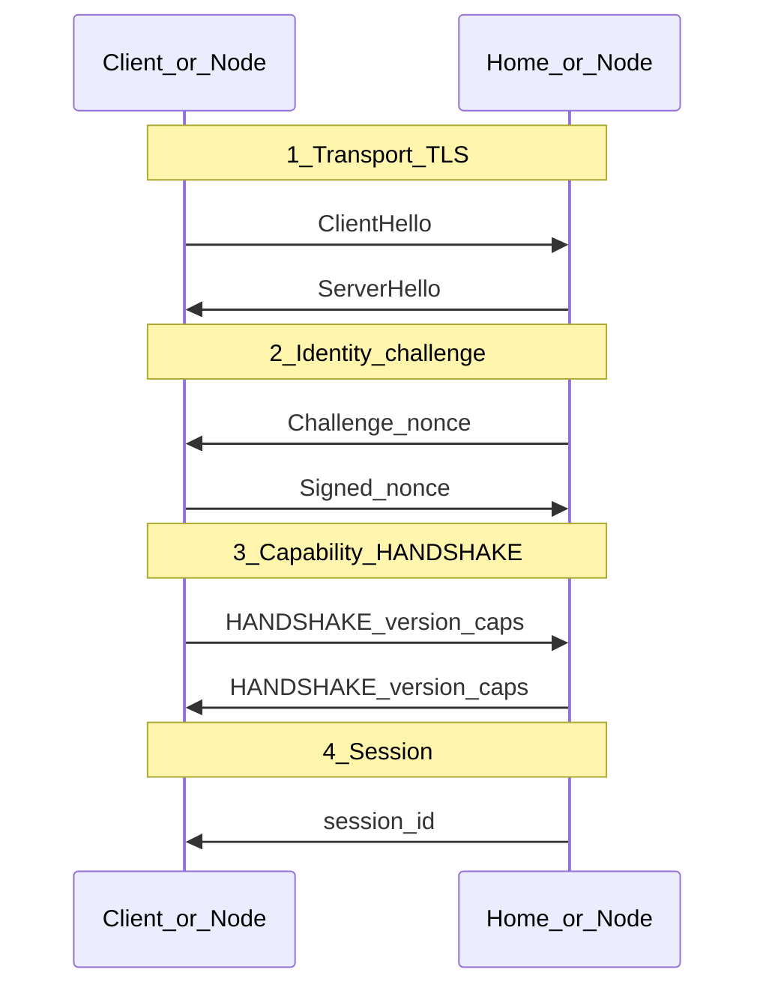
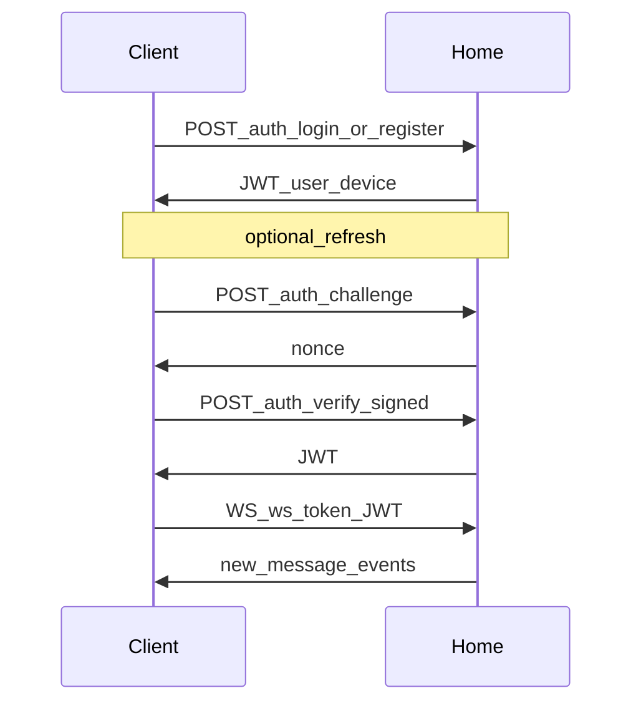

# 0200. Протокол

## Статус
Draft (R2) — логический протокол (to-be) + transport profile **`mvp-json`** (LIVE).  
Сверка: [`docs/reality/R2-wire-today.md`](../../docs/reality/R2-wire-today.md).  
Roadmap: [`docs/DEVELOPMENT-ROADMAP.md`](../../docs/DEVELOPMENT-ROADMAP.md).

## Назначение
Описание прикладного протокола обмена сообщениями: версии, состояния,
рукопожатие. Спецификация в терминах Protocol ([[0004_GLOSSARY]]) не
зависит от языка реализации (Protocol Before Implementation,
[[0003_ENGINEERING_PRINCIPLES]]).

Сериализация и транспорт LIVE на этапе MVP — **не** бинарный Packet-stream,
а HTTP/JSON + WebSocket. Это profile `mvp-json` (см. ниже и
[0201_PACKETS.md](0201_PACKETS.md)). Смена на protobuf/binary — будущий
`MAJOR`, не блокер текущих фаз roadmap.

---

## Версионирование протокола

Протокол версионируется по схеме `MAJOR.MINOR`:
- `MAJOR` — несовместимые изменения формата или семантики Packet.
- `MINOR` — обратно совместимые дополнения.

В целевой модели версия передаётся в заголовке каждого Packet и
согласуется на handshake.

В **`mvp-json`**: отдельного поля `protocol_version` на connect нет.
Версионируются:
- `crypto_version` внутри message envelope (`signal-v1`, …);
- `software_version` / `build_hash` ноды в Discovery Record;
- клиентский release manifest (auto-update), не handshake.

Реализация to-be обязана отклонять неподдерживаемый `MAJOR`.  
Полная процедура — [0204_VERSIONING.md](0204_VERSIONING.md).

---

## Установление соединения / handshake (to-be)

Целевая последовательность (единый Packet-канал):

1. **Transport handshake** — TLS 1.3 / QUIC между соседями ([0103_NETWORK.md](0103_NETWORK.md)). Не заменяет E2EE.
2. **Identity handshake** — challenge-response на Identity/device key ([0300_CRYPTO.md](0300_CRYPTO.md)). Пароли не используются.
3. **Capability negotiation** — версия протокола + список Capability.
4. **Session establishment** — `session_id`; Session → `ACTIVE`.

### Состояния сессии (to-be)

`INITIATING → HANDSHAKING → ACTIVE → IDLE → CLOSED`

- `ACTIVE` — обмен Packet.
- `IDLE` — состояние сохранено локально, восстановление без полного handshake (Offline First).
- `CLOSED` — нужен новый handshake. Потеря Session ≠ потеря Identity.

### Таймауты и ошибки (to-be, нормативные цели)

| Этап | Таймаут (референс) | Ошибка / поведение |
|------|--------------------|--------------------|
| Transport | OS / 10–30 s | retry с backoff; смена адреса из Record |
| Challenge | 120 s | `CHALLENGE_EXPIRED`; новый challenge |
| Capability | 10 s | `VERSION_UNSUPPORTED` / `CAPABILITY_MISMATCH` → закрыть |
| Session idle | политика клиента | переход в IDLE; при необходимости soft-resume |
| Повторное подключение | exponential backoff, cap 30 s | новый Identity handshake если Session CLOSED |

Алгоритм выбора шифров (to-be): фиксированный набор (TLS 1.3 cipher suite + E2EE `crypto_version`); negotiation только по списку поддерживаемых `crypto_version` / protocol MINOR, без произвольного cipher shopping.

---

## Transport profile `mvp-json` (LIVE — канон для R2)

На LIVE **нет** Packet `HANDSHAKE` и **нет** `session_id` протокола.
Эквивалент рукопожатия разнесён по REST + JWT + (опционально) Ed25519.

### A. Client ↔ Home

| Шаг to-be | LIVE эквивалент |
|-----------|-----------------|
| Transport | HTTP(S) к Home; TLS не обязателен в текущем cluster MVP |
| Identity | **Primary:** `POST /auth/register` / `POST /auth/login` (password bridge, ADR-0007). **Target path:** `POST /auth/challenge` → подпись → `POST /auth/verify` |
| Capability | не согласуется на connect |
| Session | JWT (`access_token`), claims `sub`, `device_id`, `exp` |
| Канал push | `WS /ws?token=<jwt>` после REST auth |

| Параметр LIVE | Значение |
|---------------|----------|
| JWT TTL | 7 дней (`access_token_expire_minutes`) |
| Challenge TTL | 120 s (in-memory на инстансе Home) |
| WS auth fail | close code `4401` |
| WS reconnect | exponential backoff, cap ~30 s (клиент) |
| Send path | REST `POST /conversations/{id}/messages` |
| Receive path | WS `new_message` (+ drain storage buffer) |

Ошибки (типичные HTTP): `401` неверный пароль/JWT; `404` device; challenge expired → новый challenge. Формальные коды `CHALLENGE_EXPIRED` как enum протокола **не** нормированы в wire.

### B. Node ↔ Node / Control Plane

| Связь | Auth LIVE |
|-------|-----------|
| Нода → Discovery register | `POST /registry/nodes` (тело Record); enrollment per ADR-0009 |
| Heartbeat | `POST /registry/nodes/{id}/heartbeat` + `Authorization: Bearer <node_token>` (после approve) |
| Home → peer Home deliver | `POST /internal/deliver`; при `INTERNAL_SECURITY_MODE=signed` — заголовки `X-Federation-*` |
| Relay hop | `POST /relay/forward` → `/internal/deliver` |
| Gateway bootstrap (клиент) | `GET /gateway/routing`, invite redeem — не message handshake |

mTLS: опционально на **Gateway**, не на home↔home data plane.

Capability ноды публикуются в Discovery Record (`capabilities[]`), не через HANDSHAKE packet.

### C. Повторные подключения (mvp-json)

1. Клиент хранит JWT (+ device keys) локально.
2. При resume / WS drop: предпочтительно `challenge`+`verify` (relogin) → новый JWT → новый WS.
3. Истёкший JWT → тот же путь; password login — fallback для нового устройства / потери ключей.

---

## Совместимость

- Новые поля логического Packet — только необязательные.
- Новые типы не ломают обработку старых.
- Несовместимое изменение → ADR + новый `MAJOR` + период параллельной поддержки.
- Пока действует `mvp-json`, смена JSON envelope ↔ protobuf не должна менять **семантику** полей (имена/смысл сохраняются; см. shared Message Envelope).

## Связанные документы

- [0201_PACKETS.md](0201_PACKETS.md)
- [0202_DELIVERY.md](0202_DELIVERY.md)
- [0203_ROUTING.md](0203_ROUTING.md)
- [0204_VERSIONING.md](0204_VERSIONING.md)
- [0205_NODE_RECORD.md](0205_NODE_RECORD.md)
- [0300_CRYPTO.md](0300_CRYPTO.md)
- [`project/shared/README.md`](../shared/README.md) — Message Envelope MVP
