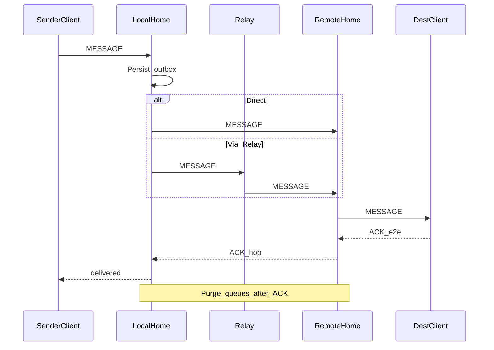
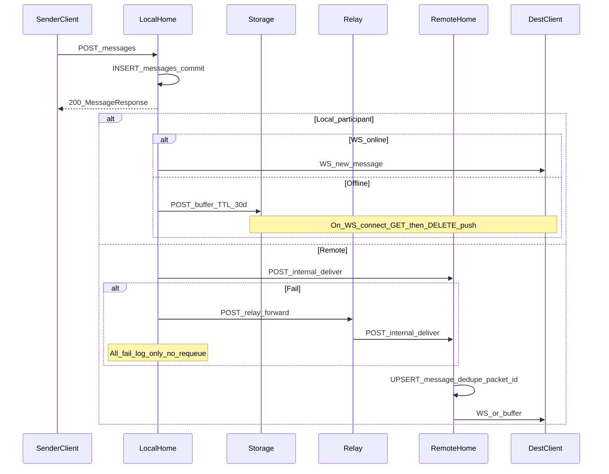
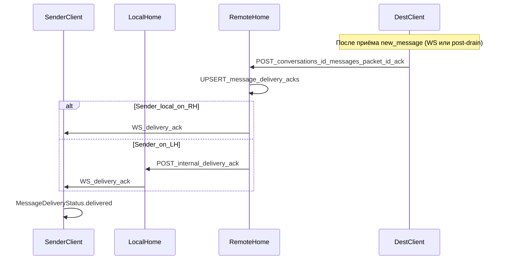

# 0202. Доставка

## Статус
Draft (R3) — гарантии to-be + profile **`mvp-json`** (LIVE).  
Сверка: [`docs/reality/R3-message-lifecycle.md`](../../docs/reality/R3-message-lifecycle.md).  
Roadmap: [`docs/DEVELOPMENT-ROADMAP.md`](../../docs/DEVELOPMENT-ROADMAP.md).

## Назначение
Гарантии доставки: подтверждения, повторные попытки, дедупликация,
порядок, очереди и очистка.

---

## Целевой жизненный цикл (to-be)

Порядок попыток маршрута — [0203_ROUTING.md](0203_ROUTING.md).

### Гарантии (to-be)

Протокол: **at-least-once** на транспорте.  
**Exactly-once** для пользователя — дедупликация по `packet_id` на
Client / Home / Storage. Потеря Packet после подтверждённого ACK
недопустима.

### ACK (to-be)

| Уровень | Смысл |
|---------|--------|
| Hop-by-hop ACK | Следующий узел принял Packet |
| End-to-end ACK | Client получателя — единственный сигнал «доставлено» для отправителя |

### Повторная отправка (to-be)

Нет ACK → retry того же `packet_id` с экспоненциальным backoff (референс
старт 2 s). После исчерпания попыток — офлайн-доставка через Storage
получателя ([0102_DATA_FLOW.md](0102_DATA_FLOW.md), [0602](0602_STORAGE_NODE.md)).

### Очереди (to-be)

| Очередь | Где | TTL | Удаление |
|---------|-----|-----|----------|
| Outbox отправителя | Local Home (или Client) | пока нет e2e ACK / политика | после e2e ACK |
| Hop buffer | промежуточный узел (если durable) | короткое окно retry | после hop ACK |
| Offline inbox | Storage получателя | дни–недели (референс 30 d) | после выдачи Client **и** e2e ACK (идеал) |
| Dedup window | каждый приёмник | ≥ max retry window | по TTL окна |

### Дедупликация / порядок (to-be)

- Короткоживущий набор `packet_id`; повтор → без повторной обработки, с повторным ACK.
- Порядок в Conversation: per-sender sequence; глобальный порядок между отправителями не гарантируется.

---

## Profile `mvp-json` (LIVE — канон R3)

На LIVE **нет** Packet ACK, **нет** outbox-таблицы, **нет** автоматического
requeue после неудачной federation. «Успех» для отправителя ≈ локальный
commit + HTTP 200.

### Фактический путь

### Где «очередь» сегодня

| Место | Есть? | Поведение |
|-------|-------|-----------|
| Home `messages` | да | Долговременное хранение истории; **не** outbox |
| Outbox / retry queue | нет | Federation fail → log; sender уже получил 200 |
| Relay queue | нет | Sync forward, timeout ~10 s; multi-relay try на стороне Home |
| Storage `/buffer` | да | Только **локальный** offline (нет WS); TTL **30 дней**; DELETE при drain |
| Client outbox | нет | Send только если session + WS connected |
| Client delivery status | частичный → e2e ACK (Post-R5) | UI: `sending`→`sent`→`delivered` по WS `delivery_ack`; hop ACK **нет** |
| Home `message_delivery_acks` | да (Post-R5) | Idempotent persist по `(packet_id, from_user_id)` |

### End-to-end delivery ACK (Post-R5, mvp-json — wire в работе)

**Не** hop-by-hop Packet ACK (to-be остаётся aspirational). **Не** меняет purge Storage
buffer: DELETE по-прежнему только после успешного WS push (`drain_buffer`), не после
client ACK.

| Шаг | Контракт |
|-----|----------|
| Recipient → Home | `POST /conversations/{id}/messages/{packet_id}/ack` (auth recipient) |
| Persist | `message_delivery_acks`; повтор → idempotent 200 |
| Fanout к отправителю | WS `{type: delivery_ack, packet_id, conversation_id, from_user_id, acked_at, …}` |
| Federation | Remote Home → `POST /internal/delivery-ack` на Home отправителя |
| Sender client | `delivery_ack` → `MessageDeliveryStatus.delivered` (не эвристика peer online) |

**Отличие от read receipt:** `delivered` = получатель **принял** сообщение на клиенте
(REST ACK + Home persist). `read` / `read_receipt` = прикладной encrypted control
«прочитано в UI» — отдельный канал, может прийти позже или не прийти.

### Что считается «доставлено» (mvp-json)

| Событие | Смысл |
|---------|--------|
| REST 200 на send | Home принял и сохранил; fanout best-effort; **не** e2e |
| HTTP 200 `/internal/deliver` | Remote Home принял (auth+persist); **не** e2e |
| WS `new_message` доставлен в сокет | Best-effort push; без ACK от клиента |
| **POST …/messages/{packet_id}/ack** | **E2e delivery ACK** (Post-R5); единственный wire-сигнал «доставлено» для отправителя |
| WS `delivery_ack` на Home отправителя | Отражение e2e ACK для UI отправителя |
| Buffer drained + DELETE | Выдано на WS; purge **не** привязан к client ACK (WS-success only) |
| Read receipt (`content_type: read_receipt`) | «Прочитано» в чате; **не** delivery ACK и **не** `delivered` |

### Дедупликация LIVE

- Remote/local insert: `Message.id == envelope.packet_id` — повторный deliver не дублирует строку.
- Клиент: dedup по `msg.id`; echo absorb для своих pending.

### Таймауты LIVE (референс)

| Hop | Timeout |
|-----|---------|
| Direct `/internal/deliver` | ~5 s |
| Relay forward client | ~10 s |
| Buffer TTL | 30 d |
| Client WS reconnect | backoff cap ~30 s |

---

## Политика очередей — целевое уточнение после MVP

| # | Политика | Статус Post-R5 |
|---|----------|----------------|
| 1 | Semantic **e2e ACK** Client→Home → `delivery_ack` отправителю | **done** (`/ack`, `message_delivery_acks`, WS/federation) |
| 2 | Durable **outbox** при fail federation | **done** |
| 3 | Purge buffer по WS-success, **не** по client ACK | **done** (осознанное отличие от to-be «purge after e2e ACK») |
| 4 | Отделить read receipt от delivery ACK в API и UI | **частично** — wire разведён; UI `read` vs `delivered` — по мере внедрения ACK |

Hop-by-hop Packet ACK и purge inbox «после e2e ACK» остаются **to-be**; LIVE buffer TTL/purge
не ждёт client ACK.

## Связанные документы

- [0200_PROTOCOL.md](0200_PROTOCOL.md), [0201_PACKETS.md](0201_PACKETS.md)
- [0203_ROUTING.md](0203_ROUTING.md)
- [0601_RELAY_NODE.md](0601_RELAY_NODE.md), [0602_STORAGE_NODE.md](0602_STORAGE_NODE.md)
- [`project/shared/README.md`](../shared/README.md)
