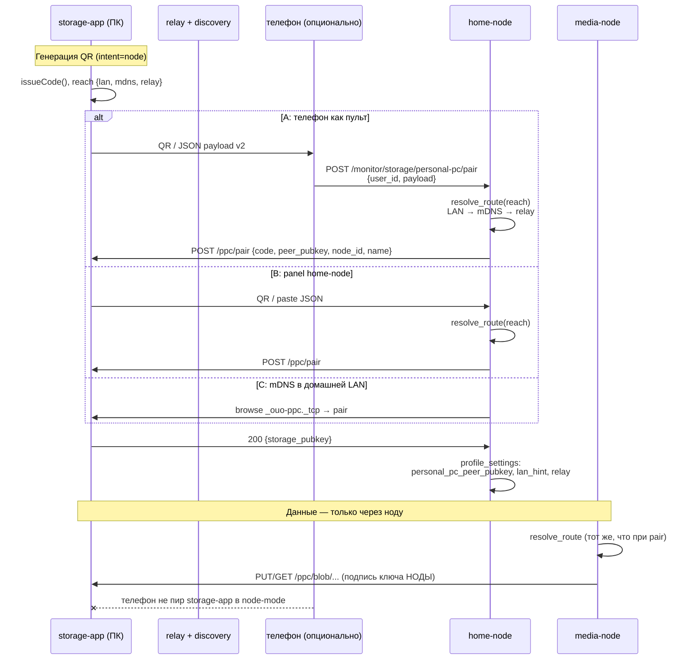
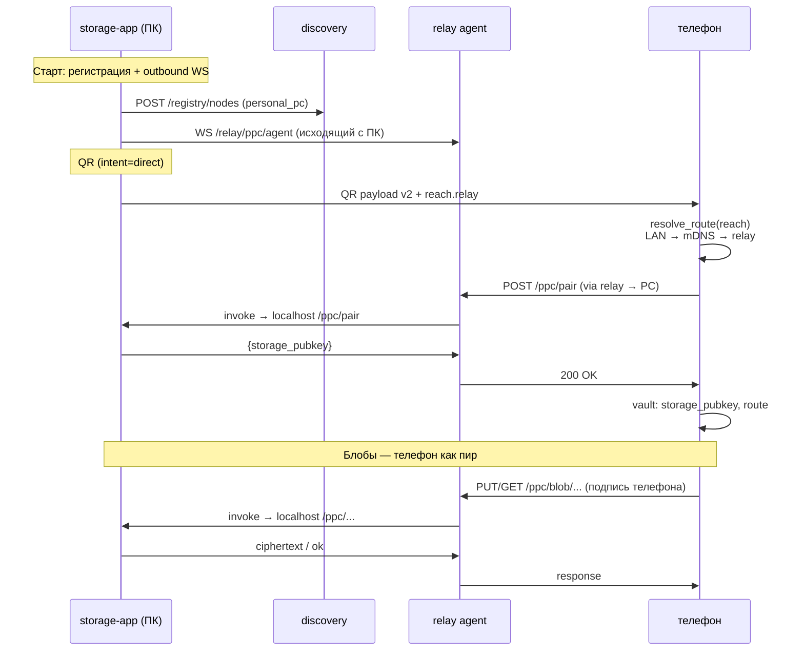

# Сопряжение по QR — unified-модель (node-mode / direct-mode)

Единая модель QR-сопряжения для storage-app: один формат payload, два режима
(`intent`), общий порядок разрешения маршрута до ПК. Дополняет
[`PAIRING.md`](PAIRING.md) (ключи, подтверждение, revoke) и
[`WIRE.md`](WIRE.md) (HTTP-контракт `/ppc/pair` и blob-операции).

---

## 1. Два режима

| | **Node-mode** | **Direct-mode** |
|---|---|---|
| **Кто клиент storage-app** | media-node (`personal_pc` backend) | телефон (`../frontend`) |
| **Кто в `paired_peers` на ПК** | Ed25519 **ноды** | Ed25519 **телефона** |
| **Зачем QR** | привязать ПК к **вашей** home-node | привязать ПК к **телефону** без своей ноды |
| **Роль телефона** | опциональный UI (scan → home-node API) | обязательный инициатор pair |
| **Путь данных после pair** | телефон → home-node → media-node → ПК | телефон → ПК (напрямую по протоколу) |

**Node-mode:** pairing делает **home-node / media-node** от имени пользователя.
Телефон может только отсканировать QR и передать payload в
`POST /monitor/storage/personal-pc/pair` — это пульт, не пир storage-app.

**Direct-mode:** pairing и все PUT/GET выполняет **телефон** как самостоятельный
пир. Home-node нужна для чатов/E2EE, но **не** для хранения блобов.

---

## 2. QR payload v2

Один JSON в QR и в буфере обмена. Поле `kind` сохраняется для обратной
совместимости с парсерами v1.

### Схема

```json
{
  "v": 2,
  "kind": "ouo_ppc_pair",
  "intent": "node",
  "code": "123456",
  "storage_pubkey": "ed25519:BASE64...",
  "fingerprint": "aa:bb:cc:...",
  "expires_at": 1710000300,
  "reach": {
    "lan": ["192.168.1.10"],
    "port": 7345,
    "mdns": "_ouo-ppc._tcp",
    "relay": {
      "discovery_url": "https://discovery.example.org",
      "storage_node_id": "storage-abc123"
    }
  }
}
```

### Поля

| Поле | Тип | Описание |
|------|-----|----------|
| `v` | `2` | Версия payload. Парсеры принимают также `v: 1` (legacy, см. §7). |
| `kind` | `"ouo_ppc_pair"` | Маркер типа. |
| `intent` | `"node"` \| `"direct"` | Режим сопряжения (§1). По умолчанию `"node"`. |
| `code` | string | 6 цифр, TTL 5 мин, одноразовый. Защита `POST /ppc/pair`. |
| `storage_pubkey` | string | `ed25519:<base64>` — публичный ключ storage-app. |
| `fingerprint` | string | Отпечаток ключа для сверки (MITM-защита). |
| `expires_at` | int | Unix sec — истечение `code`. |
| `reach` | object | Способы достучаться до ПК (§3). |

### `reach`

| Поле | Тип | Описание |
|------|-----|----------|
| `lan` | string[] | IP-адреса ПК в LAN (может быть пустым, если доступен только relay). |
| `port` | int | Порт HTTP-сервера PPC (по умолчанию **7345**). |
| `mdns` | string | Имя сервиса mDNS для browse (по умолчанию `_ouo-ppc._tcp`). |
| `relay` | object \| null | Хинты для маршрута через relay (null, если relay не настроен). |
| `relay.discovery_url` | string | URL discovery-реестра, где зарегистрирован storage-app. |
| `relay.storage_node_id` | string | ID ноды storage-app в discovery (для маршрутизации через relay agent). |

### Кто что делает после scan

| `intent` | Сканирует | Действие |
|----------|-----------|----------|
| `"node"` | телефон / panel / home-node | → home-node API → `POST /ppc/pair` → сохранить в `profile_settings` |
| `"direct"` | телефон | → `POST /ppc/pair` → сохранить `storage_pubkey` в локальный vault телефона |

Wire-контракт pair не меняется: см. [`WIRE.md`](WIRE.md) §Сопряжение.

---

## 3. Разрешение маршрута (route resolution)

**Pairing и последующие PUT/GET должны использовать один и тот же маршрут**
до ПК. Иначе pair пройдёт по LAN, а media-node в облаке до ПК не доберётся.

### Порядок (общий для всех инициаторов)

```
1. LAN      — HTTP на reach.lan[i]:reach.port (из QR или конфига)
2. mDNS     — browse reach.mdns, SRV → host:port, TXT fp/pk для сверки
3. relay    — запрос через relay agent (storage-app держит исходящий WS)
```

При успехе на шаге N дальнейшие запросы идут тем же транспортом, пока он
жив. Failover: при ошибке текущего маршрута — повтор resolver с того же
списка (с backoff), не смешивать LAN-pair с relay-data.

### LAN

Прямой `POST /ppc/pair` на `http://<host>:<port>/ppc/pair`. Работает, когда
инициатор и ПК в одной сети (домашняя Wi‑Fi, проводная LAN).

### mDNS

storage-app **advertise** сервис `_ouo-ppc._tcp` с TXT `fp`, `pk`.
Инициатор **browse** в LAN → получает SRV (host, port) → HTTP как в LAN.
Сверка `fingerprint` / префикса `pk` с payload до pair.

### Relay agent

storage-app — **клиент сети**, не сервер в интернете:

1. Регистрация в discovery (`POST /registry/nodes`, capability `personal_pc`,
   heartbeat ~60 с).
2. Исходящий WebSocket к relay: `/relay/ppc/agent`.
3. Relay **invoke** → storage-app проксирует на `http://127.0.0.1:<port>/ppc/...`
   и возвращает ответ.

Инициатор (home-node, media-node, телефон) шлёт HTTP PPC **на relay** с
адресацией по `storage_node_id` / `storage_pubkey` из `reach.relay`.
Relay — **недоверенный транзит**; аутентификация — Ed25519 пира (WIRE.md).

---

## 4. Sequence diagrams

### 4.1 Node-mode (ПК ↔ нода, телефон — опциональный UI)



### 4.2 Direct-mode (телефон ↔ ПК, без своей ноды)



---

## 5. Реализация: сегодня vs фазы

Дорожная карта unified-модели по фазам. **Актуальный срез по компонентам**
(что уже в коде, что частично) — см. [§ Implementation status](#implementation-status);
здесь — только план и остаток работ.

### Фаза 1 — QR «реально работает» через relay

Цель: pair и data до ПК из облака/LTE, не только из домашней LAN.
**Статус:** в основном готово ✅

| # | Задача | Где |
|---|--------|-----|
| 1 | ✅ Payload v2: `intent`, `reach` | `storage-app/app/lib/pairing/payload.dart` |
| 2 | ✅ Discovery registration + heartbeat | `storage-app/app/lib/net/discovery_register.dart` |
| 3 | ✅ Relay agent (WS `/relay/ppc/agent` → localhost PPC) | `storage-app/app/lib/net/relay_agent.dart`, `relay-node/app/ppc_agent.py` |
| 4 | ✅ Старт relay + discovery при `PPC_RELAY_URL` | `storage-app/app/lib/app.dart` |
| 5 | ✅ Route resolver: LAN → mDNS → relay | `shared/storage/personal_pc_pairing.py` |
| 6 | ✅ Парсер v2 + fallback на v1 | `personal_pc_pairing.py` |

Env storage-app: `PPC_DISCOVERY_URL`, `PPC_STORAGE_NODE_ID`, `PPC_RELAY_URL`.

### Фаза 2 — UX node-mode + transport на ноде

**Статус:** готово ✅

| # | Задача | Где |
|---|--------|-----|
| 1 | ✅ mDNS browse `_ouo-ppc._tcp` | `shared/storage/personal_pc_pairing.py` |
| 2 | ✅ Panel: QR-сканер → `POST .../personal-pc/pair` | home-node panel |
| 3 | ✅ Телефон: scan QR → pair API | `../frontend` (`PersonalPcPairingScreen`) |
| 4 | ✅ `_RelayTransport` в media-node | `backends/personal_pc.py` |
| 5 | ✅ `_CompositeTransport` (LAN→relay failover для blob) | `backends/personal_pc.py` |

### Фаза 3 — Direct-mode на клиенте

**Статус:** готово ✅ (базовый media bridge для изображений)

| # | Задача | Где |
|---|--------|-----|
| 1 | ✅ Frontend: pair с `intent=direct` | `../frontend` (`PersonalPcPairingScreen`) |
| 2 | ✅ Frontend: PPC client (PUT/GET/DELETE, Ed25519) | `../frontend/lib/services/ppc/` |
| 3 | ✅ Локальный vault: `storage_pubkey`, route, fingerprint | secure storage телефона |
| 4 | ✅ UI: «Подключить хранилище на ПК» без своей ноды | settings / onboarding |
| 5 | ✅ PUT/GET blob в UI чатов (фото, `ppc:` media_id) | `PersonalPcMediaStore` + `AppController` |
| 6 | ✅ mDNS browse на телефоне при pair | `ppc_mdns.dart` |

**Дальше:** failover transport на frontend при обрыве; файлы/видео; выбор backend по `storage.media_location`.

---

## 6. Ограничения и инварианты

- **Один маршрут** для pair и data — обязательно.
- **Код одноразовый** — после успешного `/ppc/pair` повтор с тем же code → `403`.
- **Relay недоверенный** — каждый запрос подписан Ed25519 пира (WIRE.md).
- **Node-mode:** в `paired_peers` только ключ **ноды**; телефон не шлёт PUT на ПК.
- **Direct-mode:** в `paired_peers` ключ **телефона**; home-node в storage не участвует.

---

## Implementation status

Актуальный статус реализации unified-модели (на момент написания).

**Реализовано:**

- QR payload **v2** (`intent`, `reach`) — `storage-app/app/lib/pairing/payload.dart`
- Route resolver: LAN (все `reach.lan`) → mDNS browse (`_ouo-ppc._tcp`) → relay — `shared/storage/personal_pc_pairing.py`
- Relay agent: WebSocket `/relay/ppc/agent` + invoke → localhost PPC — `relay-node/app/ppc_agent.py`
- storage-app: исходящий relay agent + регистрация в discovery — `net/relay_agent.dart`, `net/discovery_register.dart`
- media-node: `_LanDirectTransport`, `_RelayTransport`, `_CompositeTransport` (LAN→relay failover) — `backends/personal_pc.py`
- Owner panel: QR-сканер камеры + `POST /monitor/storage/personal-pc/pair` — home-node panel
- Frontend direct-mode: `lib/services/ppc/` (client, vault, mDNS browse, **CompositePpcTransport** failover), `PersonalPcPairingScreen`, `PersonalPcMediaStore` + `PersonalPcMediaPolicy` (`storage.media_location`), PUT/GET фото/файл/видео в чатах
- CI smoke: `scripts/ppc_smoke/` (unit + docker relay + **`run_e2e_smoke.sh`** local/opt-in)
- storage-app: encrypted `meta.db.enc` (`PPC1` AES-GCM + crash recovery + `flushEncrypt`) + OS keystore; refcount + GC; **streaming GET** + HTTP Range
- Chat UI: превью файлов (`open_filex`) и видео (`video_player`) в пузырях
- Strict enrollment runbook: `docs/modules/backend/ENROLLMENT-STRICT.md` + `approve-pending-nodes.sh --list`

**Ещё нет / частично:**

- SQLCipher-native meta.db (MVP: AES-GCM `PPC1` envelope + crash recovery; native — позже)
- Range на клиентах media-node / Flutter (на storage-app streaming GET + Range уже есть)
- Автоматический full E2E в CI по умолчанию (скрипт `run_e2e_smoke.sh` — local / `workflow_dispatch` + `run_e2e`)

---

## 7. Обратная совместимость (payload v1)

Legacy v1 (см. WIRE.md) — плоский JSON без `reach`:

```json
{"v":1,"kind":"ouo_ppc_pair","code":"123456","storage_pubkey":"ed25519:..",
 "fingerprint":"aa:bb:..","port":7345,"lan":["192.168.1.10"],"expires_at":1234567890}
```

Парсер v2:

- `v == 1` или отсутствие `reach` → синтетический `reach` из `lan` + `port`,
  `intent = "node"`, `relay = null`.
- LAN-only pair как сейчас; relay/mDNS resolver не вызывается без `reach.relay`.

---

## 8. Связанные документы

| Документ | Содержание |
|----------|------------|
| [`PAIRING.md`](PAIRING.md) | Ключи, подтверждение, revoke, список пиров |
| [`WIRE.md`](WIRE.md) | HTTP `/ppc/*`, заголовки подписи, v1 QR example |
| [`SPEC.md`](SPEC.md) | §7 транспорт LAN / relay, роли компонентов |
| [`SETTINGS.md`](SETTINGS.md) | Статус реализации, конфиг transport |
| [`BACKEND_PERSONAL_PC.md`](BACKEND_PERSONAL_PC.md) | media-node backend, LAN vs relay |
